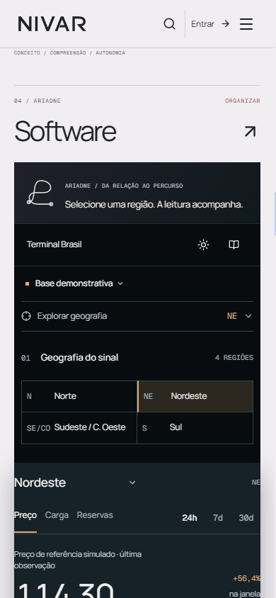

# G2.1 fresh brief critic

Review date: 2026-09-11. Baseline: `69a84a5`. Scope: intended functional/design purpose, using the owner brief and G0/G1 canon. This is a fresh brief review, not a world-class craft certification.

## Verdict

**PASS, bounded to the reviewed functional/design purpose.** The build preserves the distinction between evidence, hypothesis, and conclusion while making that distinction visible in richer media and a more useful instrument. The two actionable findings were accepted and corrected during this review. No critical business-logic or authentication regression was found in the bounded diff inspection. This is not a blanket declaration that G2.1 is world-class or ready for delivery.

This does not approve deployment, assert backend correctness, or certify that the work matches the strongest external visual references. The independent craft critic owns that comparison.

## Evidence and journey

The supplied captures were opened before the relevant runtime code was inspected. Most are from `portal-review`, the latest `motion-review`, `terminal/priority-pass`, family iteration 03/04, and the named account/operator references. Responsive samples include 390, 430, 768, 1024, 1440 and 1920 pixels where available; not every route was inspected at every width.

1. **Enter Portal — healthy.** The public thesis leads to a clear Terminal action and a method film. The new typography has distinct interpretive, interface, and technical roles. [Desktop opening](portal-review/1440-opening.png), [430 opening](portal-review/430-opening.png), [1024 opening](portal-review/1024-opening.png).
2. **Follow the method film — purpose achieved within capture limits.** `EV—001` survives measurement, a ledger, incomplete observations, examination, and publication. Missing intervals are not silently plotted as zero. The conclusion remains “Tendência não demonstrada.” Generated territory is labeled separately from the synthetic series. Desktop/mobile footage sources and a poster exist. The latest motion report records 29 checks, no uncontained evidence plane, and no runtime exceptions; reduced motion and manual pause are recorded. [Sequence](motion-review/desktop-sequence.jpg), [latest mobile question](motion-review/390-question.png), [motion report](motion-review/report.json).
3. **Choose a family and its product — corrected.** Family identities are visible and the chapter index supplies continuity during ordinary scrolling. Product destinations now differ from family introductions. Software now shows the existing native instrument beneath Ariadne. The final 390-pixel capture shows Nordeste selected in both the regional control and series heading, with the corresponding changed reading. [Revised desktop Software chapter](references/nivar-g21-software-native.png), [mobile selected state](references/nivar-g21-software-native-390.png), [integrated mobile house chapter](references/nivar-g21-house-mobile-integrated.png).
4. **Enter a family — healthy at the reviewed states.** Intelligence presents a publication; Advisory lets a claim move through evidence, contradiction, and opinion; Academy pairs reading with real Alexandria routes; Software has a working instrument; Hardware shows constructed material and clearly declares its development status. The families no longer depend on one identical hero composition. [Intelligence](families/screens/iteration03-intelligence-1440-0.png), [Advisory](families/screens/iteration03-advisory-1440-0.png), [Academy](families/screens/iteration03-academy-1440-0.png), [Software](families/screens/iteration04-software-1440-0.png), [Hardware](families/screens/iteration03-hardware-1440-0.png).
5. **Inspect Terminal — healthy demonstration boundary.** Selection is legible in geography, plot, observation, and timeline. The source lens exposes synthetic origin, calculation, coverage, and limits. Mobile prioritizes the plot and lets geography expand deliberately. The distinction between the last observation and the inspected observation is explicit. [Desktop](terminal/priority-pass/1440-dark.png), [mobile](terminal/priority-pass/390-dark.png), [expanded geography](terminal/priority-pass/390-map.png), [source lens](terminal/priority-pass/1440-sources.png).
6. **Enter account or operator — structurally preserved at the reviewed states.** Account retains the functional form, visible focus and honest password-recovery limitation. Operator retains queue, selection, counts, and explicit illustrative/local-draft status. These captures do not prove successful authentication or real case submission. [Account](references/nivar-g21-account-material.png), [operator](references/nivar-g21-operator.png).

## Highest-priority finding and correction

**The clearest functional gap was misleading product navigation in the new house chapters.** The visible links named “Alexandria”, “Terminal Brasil”, and “Energy Brief” originally used the same family destination as each large family heading. This caused an extra introduction where the visitor had selected a named product. `HouseChapters.tsx` now uses a separate `productPath`, and the supplied targets resolve to the existing `/alexandria?trilha=brasil`, `/br/terminal`, and `/br/brief` routes. This correction is entirely within frontend scope.

The strongest design-purpose gap was the Software chapter's static substation/portrait collage. “Organizar” named a behavior that the main visual did not demonstrate. The revised desktop capture replaces that scene with the existing native `TerminalPreview`, accompanied by Ariadne and an explicit selection instruction. The visitor can now see how region, reading, and source relate.

The follow-up continuity check is also closed: the current `G2Portal.tsx` no longer imports or renders its older duplicate `TerminalPreview`; the one live Portal instance resides in the Software chapter. The later dark passage remains an entry transition. This avoids repeating an independently selected workspace and unnecessarily lengthening mobile. The reviewer opened the final desktop and 390-pixel captures; the implementation pass additionally reported one compact Terminal instance and no horizontal overflow at 390 pixels.

**Largest remaining purpose concern, nonblocking:** important technical labels are small on mobile, especially the film's coverage, source and period details. Their presence is correct, but presence does not guarantee comfortable reading on a physical phone. Check these at zoom before further tightening the compositions. No new feature or backend work is needed for that check.

## Preserved boundaries

The scoped diff from `69a84a5` has no changes to authentication APIs/context, services, account TSX, operator TSX, Alexandria pages/components, or real intake implementations. Account and operator changes reviewed here are presentation CSS. Terminal retains its synthetic sample source rather than replacing it with generated footage or claiming a live feed. New G2 font variables and surface styles are scoped to the G2 surfaces; this inspection found no new global reset that would deliberately restyle Alexandria.

This is evidence of change-scope preservation, not a complete security or regression test. Alexandria still requires the final isolation check owned by the main implementation pass. Material Lab was actively being completed in parallel and was excluded from this review's outstanding findings.

## Limits and next verification

- No live backend fetch, real login, external submission, or production customer-data inspection was performed.
- Saved screenshots cannot prove keyboard order, screen-reader announcements, full WCAG compliance, or motion quality between sampled frames. The supplied interaction reports support specific behavior, but this reviewer did not rerun them.
- Small technical labels remain an accessibility risk on mobile. Important source and unit labels should be checked at browser zoom and on a physical phone; the screenshots alone do not establish a contrast or text-size failure.
- The native film includes real generated MP4 sources plus native evidence UI. It is not being counted as successful merely because an MP4 exists: its persistent record and unresolved conclusion are the relevant purpose evidence.
- The primary source labels and development declarations must survive any further aesthetic simplification.

The next useful gate is the independent craft verdict against the strongest captured references, followed by the main pass's final isolation and delivery checks.
