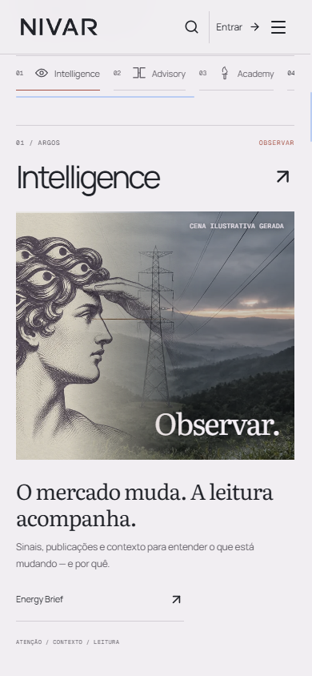
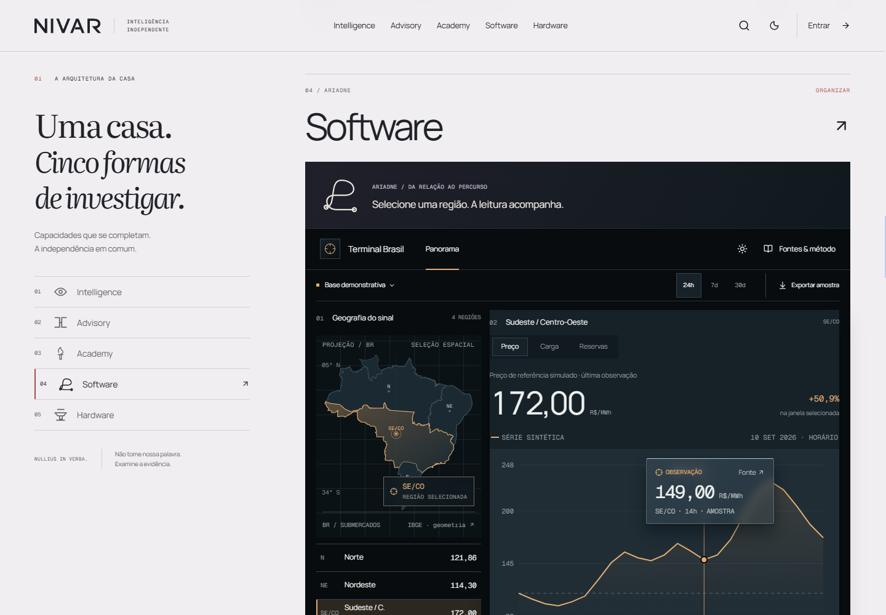
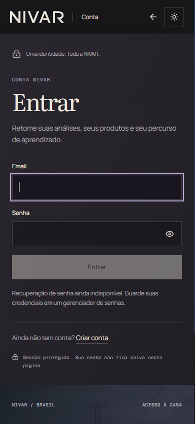
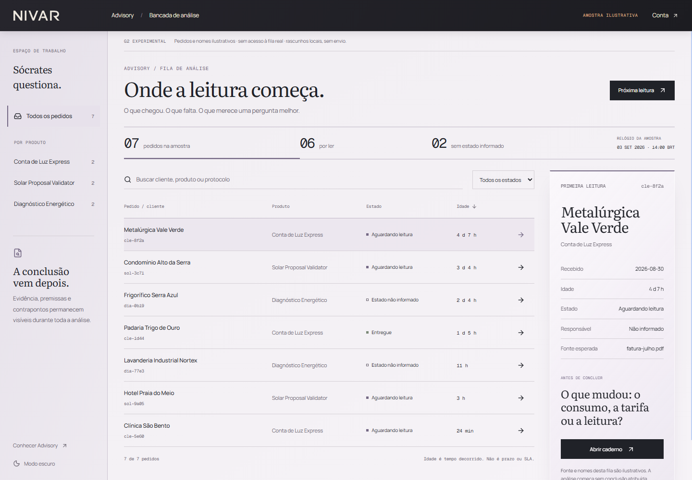
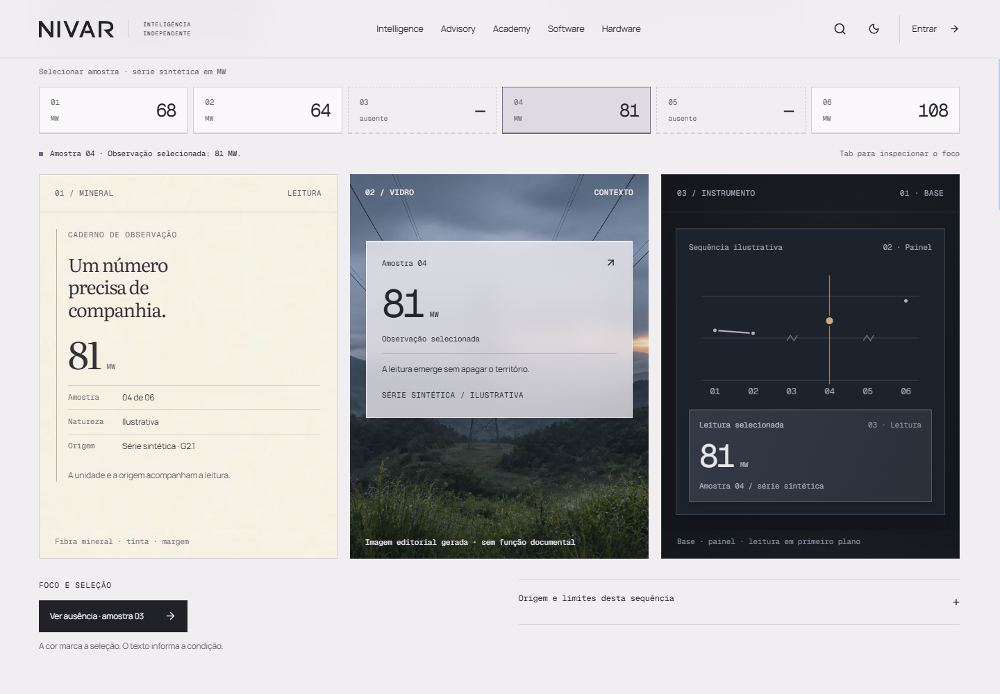
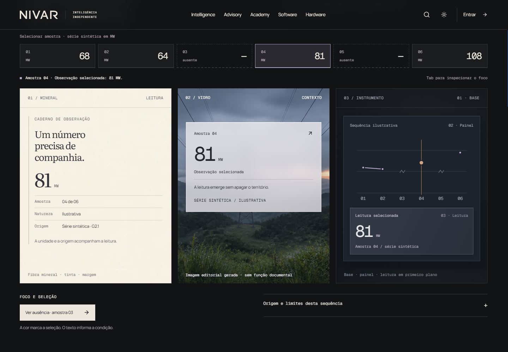
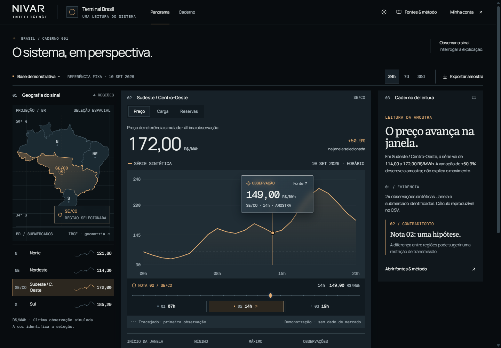
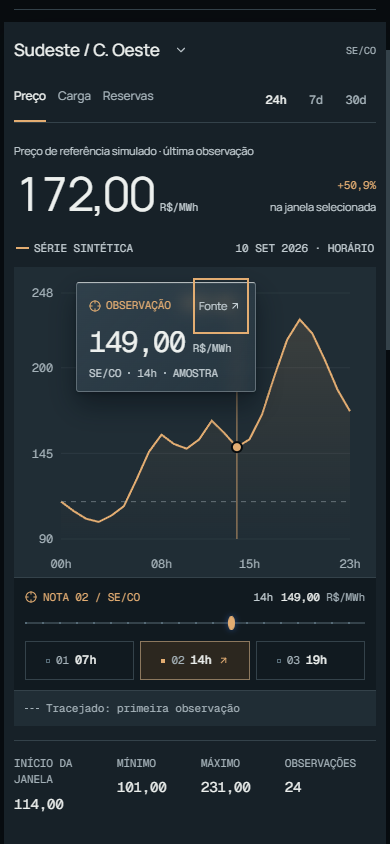
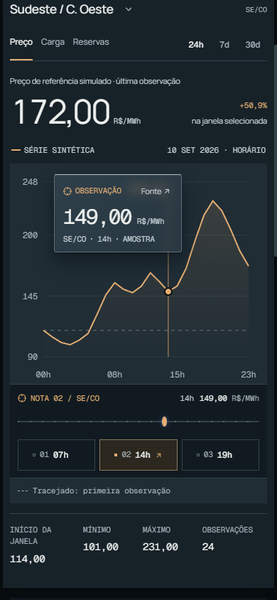
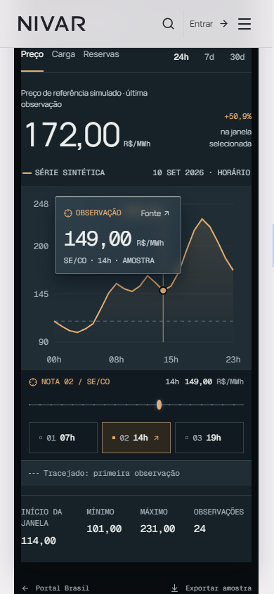

# Fresh SYSTEM critic — G2.1

2026-09-11. Read-only runtime review against `69a84a5`; only this report is written by the critic.

## Verdict

**PASS — scoped SYSTEM review, after the touch-target correction recheck.**

The initial verdict was **NO**: several newly introduced action hit boxes fell below the working canon's 40px minimum. The owners corrected the House links, family-film control, Portal transport and new Terminal controls. Final screenshots and supplied native measurements resolve the finding. No additional new purpose-critical system gap remains in this bounded review. This is not a craft or motion approval.

## Authority and scope

Read `design-system.md` as the G2.1 working canon, with `docs/g2-dream-build/g0-g1-canon.md` retaining the approved thesis. Inspected the requested supplied screenshots and the changed/new G2 CSS and TSX: shared brand and fonts, Portal and House chapters, family pages, material lab, account and operator material additions, and Terminal changes. Backend, existing baseline deficiencies, business contracts and unrelated routes are excluded.

The verdict concerns system consistency and new purpose-critical regressions. It does not certify the external-reference craft bar, the complete motion sequence, every breakpoint or full accessibility compliance.

## Screens and findings

1. **House, 390px — consistent; touch issue corrected.** The supplied image shows a readable NIVAR wordmark, recognizable micro emblems, a mineral public canvas, an editorial serif interpretation and sans functional copy. The patron and infrastructure occupy one image field. Generated-scene labeling is present. The original Energy Brief link had only the short text/rule strip as its target; the final capture and measurements show the enlarged row.

   

2. **Software chapter, 1440px — consistent.** The same identity leads into a denser native instrument. The selected region, simulated price, unit, date and synthetic-series label remain visible. The instrument is substantially darker than the public page, with a raised source record over the plot. This establishes a material hierarchy without claiming that coherence alone meets the craft bar.

   

3. **Account, dark 390px — consistent within supplied state.** The actual focused email field has a clear outline. Labels, disabled submission, unavailable recovery message and account entry remain legible. The shared wordmark, serif title and sans form copy survive the darker material. No authentication behavior was re-tested by this critic.

   

4. **Operator, 1440px — consistent within the G2.1 additions.** Sample-data disclosures, readable named states and a separate interpretation document are visible. Serif interpretation, sans queue labels and mono IDs/time remain distinct. The review does not reopen the baseline queue density or existing field sizes.

   

5. **Material lab, light 1440px — consistent evidence semantics.** All three specimen planes carry the same selected 81 MW value. The six-choice sequence explicitly retains two absent values; the chart does not connect across the gaps. The image is labeled generated and non-documentary. The paper, foreground record and instrument use clearly different treatments.

   

6. **Material lab, dark 1440px — consistent adaptation.** The operational canvas darkens while the reading-paper specimen retains its own material. Selected and absent states remain distinguishable through text and geometry as well as color. The supplied runtime record also reports a visible 2px focus outline, a preserved missing state and no broken images; those are team-produced checks, not interactions performed by this critic.

   

7. **Terminal, latest optical desktop and mobile — improved and consistent; touch recheck passed.** The inspected optical desktop capture makes source/date/unit labels materially easier to read than the earlier embedded capture. The mobile chart retains explicit simulation and unit labels, a visible source control and the selected observation. The larger source-control focus ring does not cover the selected point in the inspected corrected state. Final standalone and House captures retain a thin range track and an unobscured selected point after enlarging all new control hit areas.

   
   
   
   

## Highest-priority finding and correction record

**Resolved P2 — new controls did not consistently implement the canon's touch minimum.** The original House product links had no minimum height; the family-film control was 38px; Portal desktop transport was 38px; the new source-lens control was 28px on mobile. Subsequent owner inspection found the same issue on new timeline-note buttons, the mobile map toggle and the range input. Small hit regions made these otherwise clear actions harder to operate by touch.

Correct the actual hit boxes to at least 40px at desktop and 44px on phone, preserving the thin track and compact visual content. Verify the hit area rather than inferring success from CSS alone, and verify source-lens/selected-point clearance after resizing.

Already rechecked:

- `house-chapters.css` now sets House product links to `min-height:44px`; `final-surfaces/results.json` measures all five at 44px or above from 390 through 1920px.
- `g21-families.css` now gives the family-film control `min-height:44px`. This part is a source-level recheck; the supplied Advisory behavior checks precede this size correction.
- Hero transport is 40px on desktop and 44px on phone; the stage pause measures 40/44px in `final-surfaces/results.json`.
- The source control is 44×40px at desktop and 44×44px on phone. `terminal/optical-pass/source-touch-checks.json` reports successful hit-area samples and selected-point clearance for standalone and embedded modes, default and peak observations. The default focused mobile capture was visually inspected.

Final recheck: `terminal/optical-pass/new-targets-checks.json` measures the source button at 44×44px, all three timeline buttons at 44px high, the map toggle at 44px and the range input at 44px in both standalone and embedded phone contexts. Source hit tests pass at three sampled points; the selected observation remains clear; the lens ends before the range; container scroll width equals client width. The native keyboard check advances the selected fixture index from 14 to 15 with ArrowRight. Both corresponding final screenshots were opened and inspected. The visual track remains thin. No exceptions were reported.

## Other system checks

- **Type:** new font faces are uniquely named `Nivar Literata`, `Nivar Manrope`, and `Nivar Geist Mono`. Normal and actual italic Literata files are declared; Portuguese glyph ranges are included. Screens retain the intended interpret/organize/prove roles. No fallback-font claim is made from code alone; the final Portal runtime check reports Manrope, and the lab runtime record reports the intended trio.
- **Identity:** the Interval wordmark reads as NIVAR in the inspected desktop and phone states. Micro/standard symbols share line treatment; hero portraits remain ink on mineral material. Earlier inversion declarations in House CSS are superseded by explicit later `filter:none` rules; they are not active defects.
- **Source of truth:** film and lab use the same `68, 64, null, 81, null, 108` illustrative sequence. The rendered lab preserves gaps. Terminal snapshots explicitly identify demonstration data, simulated prices and a fixed sample date. The new code does not invent live market attribution.
- **Focus and reduced motion:** visible focus is supported by the inspected account and Terminal states and the lab's supplied runtime record. New House motion rules preserve document content and suppress transforms under reduced motion. Film code starts paused for reduced motion and pauses for hidden/offscreen states. This is source review plus supplied evidence, not a new complete motion test.
- **Isolation:** the changed/new styles use `.g2`, `.g21-*`, `.g2-account`, `.g2-ops` or `.g2-terminal` product scopes. No changed Alexandria token, asset, route or `src/main.tsx` diff was found. `.g2 .g2-alexandria-feature` styles the public Academy promotion, not the Alexandria application. The final runtime sweep reports no G2 ancestor and zero G2 nodes on `/alexandria?trilha=brasil`.
- **Overflow:** the final team sweep reports no Portal/Software page overflow at 390, 430, 768, 1024, 1440 and 1920px. The inspected corrected 390px House and Software screenshots are consistent with those measurements.

## Evidence limits

The initial requested images were explicitly supplied for this audit and were opened directly. Correction images and measurement JSON were generated by the owner/Terminal agents during this review and then read or viewed by this critic. No external writes, backend edits, new claims of market-data validity or full accessibility certification are part of this audit.
