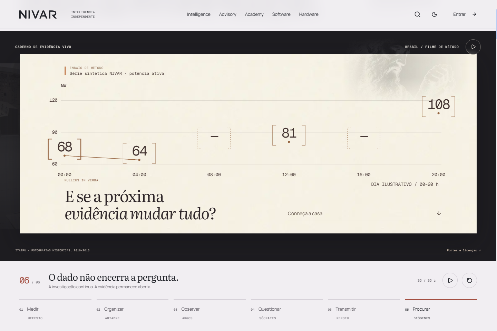
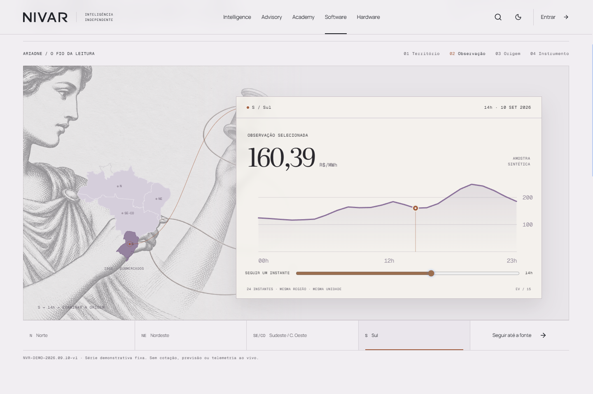
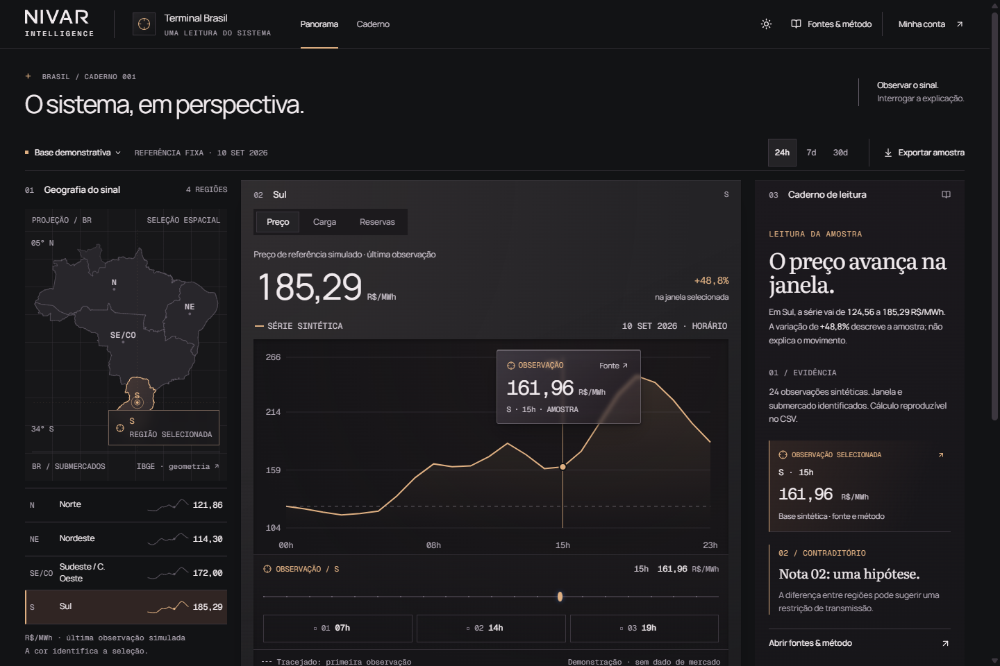
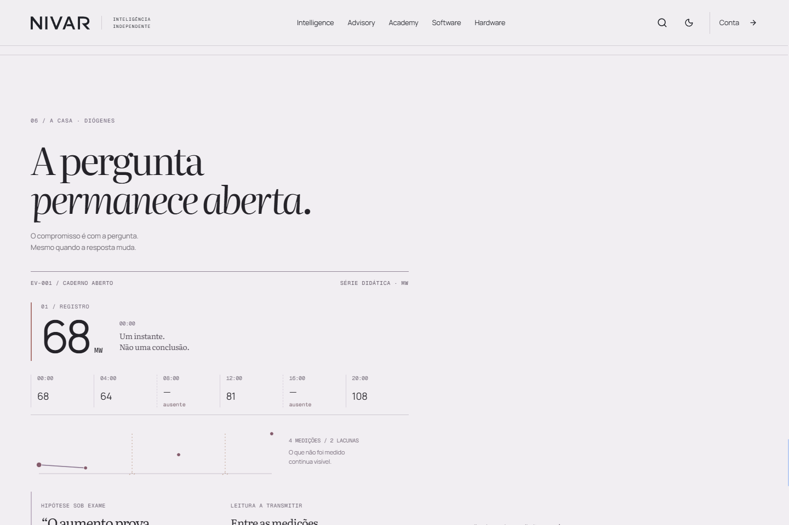

# NIVAR G2.2 — independent brief critic 01

Date: 11 September 2026. Scope: hero, Software/Ariadne, public Terminal presentation, Diógenes finale. Authority: `docs/g2-dream-build/owner-brief.md` and `docs/g2-dream-build/g2-2/owner-brief.md`. I formed the first-pass judgment without reading builder reports or earlier critics. I then checked a bounded Terminal correction after reporting the observed failure to the parent agent.

## Decisions

| Piece | Current brief decision | Reason |
| --- | --- | --- |
| Hero film | **NO** | The principal semantic requirements are substantially present, but the approved opening-film rhythm has not been delivered: it runs for 36 seconds and stops, rather than forming the constitution's approximately 15–18 second natural loop. The remaining cinematic concern is the long, largely fixed analytical composition after the photographic opening. |
| Software / Ariadne | **YES** | A selected region produces a native observation, then attached provenance, then access to the actual instrument. Ariadne has substantial presence and an actual relationship connects map selection to record. |
| Terminal public presentation | **YES, after bounded correction** | The product is withheld until the public journey earns it. Its selected observation now survives entry into the full-screen instrument. The original state-loss failure remains documented below. |
| Diógenes finale | **YES** | Diógenes commands the composition; the five families are represented by operations on one didactic record; source, gaps and uncertainty survive the synthesis; the last question remains open. |

These are brief decisions, not a claim to have won against the strongest external craft references or to have completed security, performance, or accessibility certification.

## 1. Hero — NO

**What works.** Real historical Itaipu material gives the opening a particular place. The three image sources are traceable; the text identifies the binational setting and historic nature. The synthetic method series is separately declared. A persistent bracketed 68 becomes a row and then a chart point; the rest of the observations arrange around it. The two missing intervals remain missing. The only plotted connecting segment joins the adjacent observed samples; the film does not draw through the two missing intervals. The question challenges the apparent increase, the publication carries the uncertainty, and the conclusion remains an open question. This is a material improvement on finished dashboards simply appearing over footage.

**Unmet requirement H1 — complete the opening-film rhythm.** Constitution §5.19 specifies an approximately 15–18 second film with a natural loop. The current UI explicitly shows `36 / 36 s`, changes to the play icon, and stays at the last frame. Live timing capture confirms `filmTime: 36.000`, `playing: false` at the 39-second observation. G2.2 does not explicitly repeal the earlier opening-film rhythm. The pause and chapter controls are good; they do not substitute for the requested loop.

**Bounded action.** Build a deliberate return from the open question to physical reality and make the opening a concise loop nearer the approved duration. Preserve the missing intervals, source disclosure, chapter access, and readable transcript. Do not solve this by simply accelerating all the current copy into unreadability.

**Strongest craft risk, separate from H1.** The opening changes photographic scale, but the long middle and end mostly remain the same analytical field while portraits, chart arrangement and paper treatment change. The supplied 36-second recording and fresh live samples support that observation. This still reads more as a carefully authored method demonstration than a fully cinematic flagship sequence. G2.2 §§10 and 13 ask for transitions with camera, depth, scale and distinctive family behavior. The measurement-to-table and table-to-chart movements are worth preserving; additional generic effects would not close this gap. The most useful next cinematic intervention would be one stronger scene/scale transformation around the same persistent sample.

**Evidence.** `brief-01/15-hero-live-timing.json`; `15-hero-live-04s.png`, `15-hero-live-08s.png`, `15-hero-live-15s.png`, `15-hero-live-21s.png`, `15-hero-live-27s.png`, `15-hero-live-34s.png`, `15-hero-live-39s.png`. Supplied desktop/mobile films reviewed through temporal contact sheets `hero-desktop-sheet.jpg` and `hero-mobile-sheet.jpg`. Reduced-motion live state: `14-mobile-reduced-hero.png`.

## 2. Software / Ariadne — YES

The opening provides an actual choice, rather than showing a completed Terminal. Selecting Sul changes the map, establishes a precise connection to the record, introduces an hourly sample and then a chart with a selected observation. The large patron's hands and thread participate in the same composition. The observed record remains at the center of the subsequent source disclosure. Following the source moves the field into the dark operational material before the actual Terminal is revealed.

The data is declared as a fixed synthetic demonstration, with sample version, unit, date, observation time and the absence of an official connected source. The family page also explicitly identifies API, connected series and alerts as being in development. This satisfies the constitution's requirement to distinguish the product that exists from future integration.

Keyboard ArrowRight moved the sample from 14h to 15h, and the source remained attached to the new timestamp. The mobile composition remains a usable sequence with a large patron, chart, region context and source content. No full Terminal is mounted in the initial public view.

**Unmet requirements:** none within the bounded experience after the entry correction described in step 3.

**Strongest remaining risk:** on mobile, the selected region becomes a small map beneath the main record, and the region controls sit below the tall stage. This makes comparisons slower than desktop. It does not destroy the relationship, but keep the chosen region identifiable as the chart and source take focus. Evidence: `05-mobile-ariadne-selected.png`, `06-mobile-ariadne-origin.png`.

**Evidence.** `04-desktop-ariadne-initial.png`, `05-desktop-ariadne-selected.png`, `06-desktop-ariadne-origin.png`; their mobile equivalents; `07-mobile-terminal-earned.png`; supplied motion sampled in `ariadne-desktop-sheet.jpg`. The supplied family contact sheet supports the distinction between Ariadne's integrated stage and the other family compositions, but I did not treat it as a full audit of those other families.

## 3. Terminal public presentation — YES after correction

The public architecture now earns the reveal through region → observation → origin → instrument. The separate dark Portal passage is an entry statement, not another fully formed dashboard pushed at the visitor. The revealed Terminal is interactive native UI, with a selected map region, chart point and interpretation context. Fixed date, sample nature and absence of official market data remain explicit. The interface does not simulate streaming activity, market alerts or a live clock.

**Original unmet requirement T1 — entry discarded the evidence.** In the first live pass, I selected Sul, moved to 15h / 161.96 R$/MWh, opened its origin and revealed the instrument. The embedded Terminal preserved Sul / 15h. Its “Abrir em tela inteira” action then opened the standalone Terminal at default SE/CO / 14h / 149.00 R$/MWh. This broke G2.2 §§17–21: the public journey taught continuity and lost it at entry.

**Correction and recheck.** The parent corrected the entry, and I independently repeated this exact path on the live server. The link now opened `/br/terminal?region=sul&observation=15`. The full-screen instrument retained Sul, 15h and 161.96 R$/MWh in both the chart focus and selected-observation reading. T1 is therefore resolved for this tested path. Original failure images were retained rather than overwritten by the recheck.

**Unmet requirements:** none remaining in this bounded public-entry test. Full Terminal regression testing belongs to the system review.

**Evidence.** Original pair: `07-desktop-terminal-earned.png` and `08-terminal-fullscreen-entry.png`. Corrected result: `16-entry-recheck.png` and `16-entry-recheck.json`. Portal entry: `12-portal-terminal-passage.png`; initial public family stage: `13-portal-ariadne-initial.png`.

## 4. Diógenes finale — YES

The figure is no longer a small edge illustration. His face, extended arm and lantern dominate a deliberate half-body composition on desktop and remain intact on mobile. The folio carries one observation, its surrounding sequence, gaps, a questioned hypothesis and a transmitted reading. These are meaningful family traces, not five footer logos. The source button actually exposes the origin and limits of the didactic record.

The wording does not claim that truth has been found: “A pergunta permanece aberta”, “a trajetória permanece desconhecida”, and “O que falta medir?” all support continued inquiry. The synthesis resolves the house's method without closing the investigation.

**Unmet requirements:** none at the brief level.

**Strongest remaining risk:** on mobile, the five family controls are below the folio, so choosing a gesture changes explanatory text in view while its highlighted evidence target may be well above the viewport. The meaning is still readable, but the visual cause/effect is weaker there. A compact persistent evidence trace or a clearly oriented return to the target would improve the interaction. This is a bounded enhancement, not a reason to reopen the whole composition.

**Evidence.** `09-desktop-finale-initial.png`, `09-mobile-finale-initial.png`, `10-desktop-finale-source.png`, `10-mobile-finale-source.png`, `11-mobile-finale-question.png`; supplied motion sampled in `finale-desktop-sheet.jpg` and `finale-mobile-sheet.jpg`.

## Provenance and protected boundaries

The public credits identify acediscovery / 2013 / CC BY 4.0 for the aerial; Anagoria / 2010 / CC BY 3.0 for the control room; and Leandro Neumann Ciuffo / 2012 / CC BY 2.0 for the towers. Those attributions and dates match the primary [aerial file page](https://commons.wikimedia.org/wiki/File:Itaipu_Dam,_aerial_photograph.jpg), [control-room file page](https://commons.wikimedia.org/wiki/File:Itaipu-Wasserkraftwerk_Kontrollraum.JPG), and [transmission file page](https://commons.wikimedia.org/wiki/File:Power_lines_and_Itaipu_lake_(8155778229)_(2).jpg). The tower source identifies the Paraguay side, which the public credits also state. Reframing/color changes are declared. The synthetic series is explicitly independent of those images; no measured plant output is attributed to a photograph.

No product files, Alexandria files, account/operator files or Git state were changed by this critic. I only wrote this report and audit evidence/scripts in `critics/brief-01/`. I did not independently prove Alexandria's whole render or global-CSS isolation, nor account/operator behavioral preservation. Those remain required system-review gates; this report must not be represented as their proof. No merge or deployment was performed.

## Evidence limits

Live audit used independent browser contexts on the supplied CDP endpoint and the local pages at 1440×960 and 390×844. The full live hero was allowed to run past its endpoint. Supplied recordings were inspected through chronological frames across their duration. The source was read only after initial rendered evidence, to check state persistence, disclosure and timing. No prior critic or builder report was used to form these judgments.

Pause/restart controls, source disclosure, reduced-motion hero, region selection and an arrow-key observation change were inspected. This is not a comprehensive keyboard, screen-reader, contrast, zoom, device-performance or mobile touch audit. The site changed during this audit; T1 has an explicit corrected recheck, while other decisions describe the captured states cited above.
