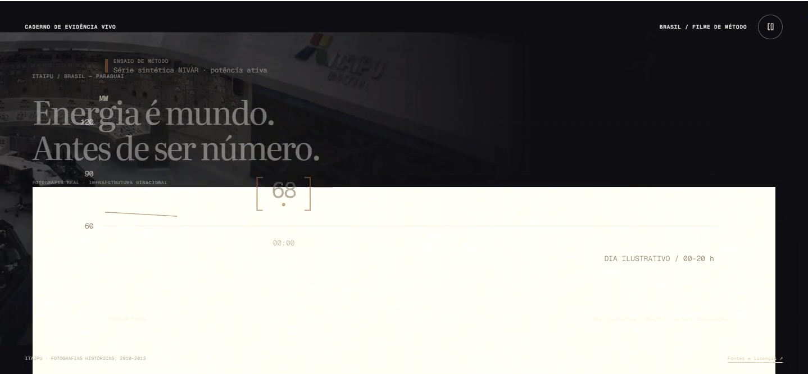
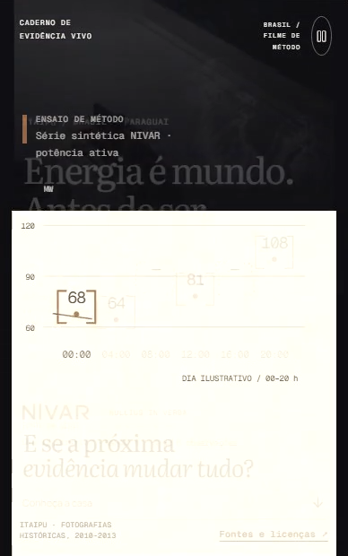

# NIVAR hero — fresh craft review 02

**Verdict: NO, narrowly, against the requested external craft bar.**

The middle of this film is authored and understandable. Its strongest idea is the same bracketed observation becoming a table member, then a chart point, then part of a portable reading. The gap is the ending-to-restart handoff: it briefly becomes a stack of outgoing and incoming layers rather than a single intelligible material transition. Fix that seam before adding more spectacle.

## Scope and method

Reviewed only the rendered hero from the supplied iteration04 desktop and mobile movies. No implementation, tests, builder rationale, previous NIVAR reviews or critique reports were read. The only project helper read was the explicitly permitted native-session.mjs capture helper. Product Design audit guidance was applied; saved project context was excluded to preserve the fresh-review boundary.

Both product movies were played from the beginning to their actual ends in native Chrome, playbackRate 1, without seeking. Native screenshots were captured during continuous playback, then inspected as full sequences and at native size. Desktop: 1438 × 666, 22.033 s; mobile: 388 × 620, 20.233 s. Both include the approximately 18-second ending-to-restart boundary and the opening of the next cycle. The complete captures took 24.2 and 21.5 wall-clock seconds respectively; capture overhead introduced some stalls, so this is a craft review, not an FPS certification. Timing records retain actual media time and wall time. A denser first desktop pass stalled heavily and was excluded from the accepted sequence.

The CRED source movie was freshly opened from its actual 60fps page, played through at 1×, and inspected. Fresh Must playback stalled at 0.364 s; for Must, Media.Work, Spark and Ten Years Away I inspected the explicitly authorized actual reference media from craft-hero-01, never its notes. Reference copies are under references/.

## Biggest remaining gap

**The paper-to-opening seam has no clean visual ownership.** At desktop 16.95 s and phone 16.65 s, the cream report is a coherent, finished composition. By desktop 17.37 s / phone 17.18 s, the outgoing sheet and its graph, the incoming opening headline, the old method heading and the returning 68 are simultaneously present. The cream surface washes out its own content while remaining very large. The first headline starts behind that surface and crosses still-visible measurement labels. The background also passes through the dark control-room image before arriving back at the dam. Desktop 17.74 s and phone 17.69 s retain remnants before resolving cleanly at 18.08 / 18.23 s.

This is a brief interruption, not a failure of the whole narrative. But it occurs at the exact seam the repeated hero asks viewers to accept. CRED's card-to-header and Must's poster-to-sheet preserve a clear owner of the composition during the handoff; the NIVAR reset exposes several parallel resets at once.

A bounded correction: choose one outgoing object to carry the transition. Let the sheet and its annotation family depart together; remove its now-invalid labels before restoring the first headline; reintroduce the photo and opening copy as one controlled arrival. If 68 survives, give it one clear path and purpose rather than leaving it as a ghost of the chart. The existing table-to-chart motion can stay intact.

## Observed sequence

1. **World / opening, 0–2 s — strong.** The real Itaipu image, Portuguese writing and visible Brasil–Paraguai identification provide specific grounding. The serif headline has scale and calm. This establishes a place rather than a generic technology background. [Desktop 0.18 s](evidence/desktop-0.18s.png).
2. **Measurement into organization, about 2–6 s — strong.** The large 68 becomes the first member of the table. The additional observations and missing rows enter as a related family. The archival figure and dark field support the editorial tone; they are atmospheric rather than the causal engine. [Desktop 4.19 s](evidence/desktop-4.19s.png), [phone 4.66 s](evidence/mobile-4.66s.png).
3. **Table into chart, about 6–9 s — strong.** The bracketed observations move through visible intermediate positions. The numbers do not simply disappear and respawn in a completed chart. The two absent observations retain a separate dotted treatment while the axis and chart organization form around the family. This is the best demonstration of interface being built. [Desktop 6.52 s](evidence/desktop-6.52s.png), [phone 6.75 s](evidence/mobile-6.75s.png), [desktop 8.50 s](evidence/desktop-8.50s.png).
4. **Limit / interpretation, about 9–12 s — strongest semantic beat.** The short 68→64 connector is supported by contiguous observed values; it does not draw a false continuous route through the two missing slots. The luminous missing columns and the conclusion about the interval make the limitation visible. This is a meaningful motion idea, not decoration. [Desktop 10.42 s](evidence/desktop-10.42s.png), [phone 10.47 s](evidence/mobile-10.47s.png).
5. **Portable reading / paper, about 12–15 s — good.** The cream surface changes the material of the same reading while the values and gaps remain identifiable. The layout feels like a composed publication. On phone the complete argument is visible and the primary text reads comfortably. Fine chart rules and secondary metadata have very low visual weight. [Desktop 13.70 s](evidence/desktop-13.70s.png), [phone 14.10 s](evidence/mobile-14.10s.png).
6. **Invitation, about 15–17 s — good.** The final NIVAR question and invitation live in the same paper composition. This is a restrained finish with a memorable light/dark change. [Desktop 16.95 s](evidence/desktop-16.95s.png), [phone 16.65 s](evidence/mobile-16.65s.png).
7. **Ending into next cycle, about 17–18.3 s — needs revision.** Several foreground and background families crossfade or reset concurrently. The phone gives the overlap a larger share of the visible composition. It resolves, but the transition itself lacks the control of the middle section. [Desktop 17.37 s](evidence/desktop-17.37s.png), [desktop 17.74 s](evidence/desktop-17.74s.png), [phone 17.18 s](evidence/mobile-17.18s.png), [phone 17.69 s](evidence/mobile-17.69s.png).

## Craft checks

| Requested dimension | Judgment from rendered evidence |
| --- | --- |
| Cinematic visual authorship | YES through the central sequence; NO at the repeated reset seam. The subdued archival energy-world treatment is a coherent direction. |
| Semantic continuity | YES through observation → table → chart → qualified reading; weakened by the concurrent reset at the end. |
| Interface build versus spawn | YES. Visible intermediate table-to-chart states are doing real work. |
| Family behavior | YES. Value brackets, missing slots, axes and report presentation have consistent roles. Reset choreography is the exception. |
| Brazil grounding | YES. Real Itaipu infrastructure, Portuguese copy and Brasil–Paraguai attribution are specific; the movie itself calls the data synthetic, avoiding an implied live site measurement. |
| Connector causality | YES. The observed connector stops before the missing data. The absence is treated as a limit. |
| Memorable moment | YES. The graph becoming a cream reading while retaining its gaps is a distinct idea. It is quieter than Spark or Media.Work but appropriate to this subject. |
| Phone craft | YES for the stable scenes and main argument; NO at the same reset overlap. Fine metadata and pale graph rules are a secondary legibility concern, not the principal blocker. |

## External comparison

- [CRED full-page offers](https://60fps.design/shots/cred-credit-card-full-page-offers-swipe-interaction): a persistent card remains spatially intelligible as the surrounding content changes. The freshly inspected playback is in [references/cred-fresh-playback.png](references/cred-fresh-playback.png).
- [Must movie detail sheet](https://60fps.design/shots/must-movie-detail-sheet): the poster is the anchor for the sheet expansion and return. Actual recorded visual sequence: [part 1](references/must-motion-01.png), [part 2](references/must-motion-02.png). The current network playback limitation is stated above.
- [Media.Work](https://media.work/): material and lighting create a singular, instantly legible focal idea. The [actual source sequence](references/media-motion.png) is a useful benchmark for how little competing information is needed during the memorable beat.
- [Spark](https://spark.thedigitalpanda.com/) and [Ten Years Away](https://ten.375.studio/): each commits to a whole visual world. NIVAR's archive-to-reading direction can stand on its own; it does not need their spectacle. The useful comparison is compositional control. [Spark evidence](references/reference-spark-scene.png), [Ten evidence](references/reference-ten-scene.png).

## Evidence and limits

- [Complete desktop playback contact sheet](desktop-complete-1x-contact.png)
- [Complete mobile playback contact sheet](mobile-complete-1x-contact.png)
- [Selected native frame index and playback provenance](evidence-index.json)
- Native selected evidence: 18 product frames. External evidence: 6 image files. Redundant transient captures were removed; product source files and Git were untouched.

A pause control is visibly present. Keyboard operation, focus order, contrast ratios, assistive technology output and reduced-motion behavior were not tested. Screenshots suggest small metadata and faint cream-state rules may need attention, but this review does not claim accessibility compliance or failure. Audio was not evaluated. Motion smoothness under an unloaded device remains outside this capture-based review.
