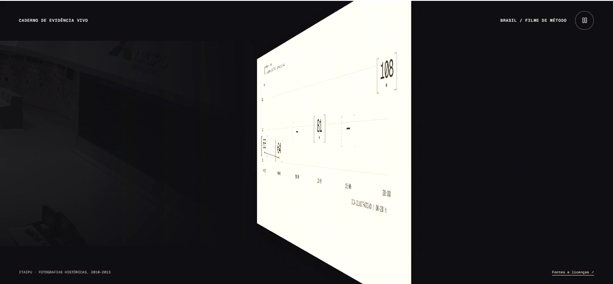
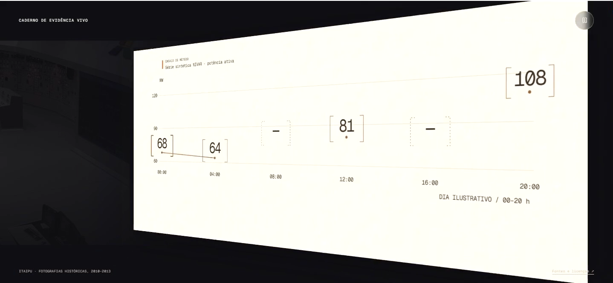
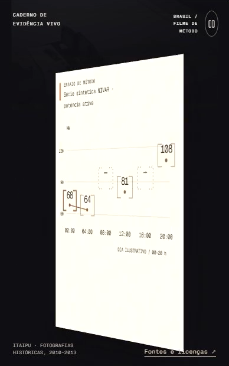
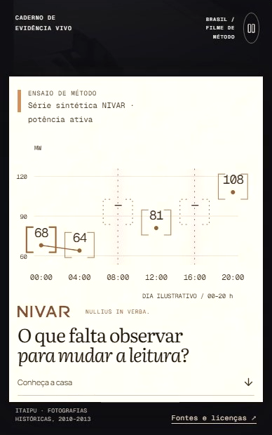

# CRAFT amendment — iteration07

**Updated overall verdict: YES on the seven requested criteria.** The earlier material and patron-behavior objections are resolved in the rendered sequence. The evidence is now the continuous protagonist of the film: captured, organized, focused, questioned, carried onto a document, and reopened for further observation.

This amendment concerns only the current `/br` rendering and the supplied iteration07 recordings. The iteration05 **NO** review and all its evidence remain intact. No implementation, rationale, tests, or builder reports were read. No product or Git changes were made.

## Review steps and playback

1. **Current desktop and phone — healthy hierarchy.** Captured the current live page at 1440 × 900 and 390 × 844. The editorial headline, primary action, and opening infrastructure scene remain clear. See [desktop](captures/01-current-desktop.png) and [phone](captures/02-current-mobile-top.png).
2. **Whole desktop recording — accepted choreography, with player-buffering limits.** The 1438 × 666 recording completed from the beginning through `ended` at 23.933333s, always at playback rate 1, without seeking. There are 75 chronological screenshot samples. Reviewer-player buffering extended capture wall time to 33.712s. See [desktop playback](desktop-playback.json).
3. **Whole phone recording — accepted choreography and primary legibility.** The 388 × 620 recording completed through `ended` at 22.766667s, always at playback rate 1, without seeking. There are 82 chronological samples. Wall time was 24.931s. See [phone playback](mobile-playback.json).
4. **Timed transition and internal-loop inspection — accepted.** Inspected every contact sheet plus native-size frames of the turn, focus, inquiry, and return. The reported times are video `currentTime` samples immediately before screenshot capture, not guaranteed exact exposure timestamps. Sixteen exact screenshot copies are curated in [the evidence index](curated-index.json).

The internal film cycle returns to infrastructure around 19–20.8s. The arbitrary encoded file endpoints were not treated as the loop. The playback evidence supports identity, staging, causality, and material ownership; buffering prevents a separate claim of uninterrupted realtime smoothness or frame-perfect performance.

## Updated criterion verdicts

| Criterion | Verdict | Current rendered basis |
|---|---|---|
| Cinematic authored transformation | **YES** | The sustained sequence transforms one set of evidence through different readings and culminates in a spatial turn of the entire graph surface. The turn provides a decisive physical transition, while the final revisiting of the missing observations gives the return a specific intellectual purpose. This now reads as an authored method film. |
| Object continuity | **YES** | The same bracket/value identities move from capture to rows to chart positions. Header, units, hours, axes, readings, and absent marks remain attached to the common plane through the document turn. See desktop 7.317–8.896s and 13.594–14.541s; phone 6.991–8.828s and 13.980–15.008s. |
| Causal graph build | **YES** | The rows establish the six time positions before the values spread into a graph. Only the adjacent observed 68→64 pair is joined. The 08:00 and 16:00 absences remain explicit throughout focus, challenge, and transmission. |
| Coherent physical material | **YES** | The earlier rectangle-under-stationary-ink behavior is gone. The graph plane first turns away, then the cream face comes around bearing the same evidence. The values, axes, and labels share the surface's perspective, scale, and exit. As a rigid matte sheet/card, it has a consistent material rule. See the three handoff frames below. |
| Phone legibility | **YES** | Main statements, values, hours, and the missing-observation argument are readable at native 388px width. The turn briefly compresses the text as expected, then returns it to a clean, stable reading plane. Source/footer microtype is still small, but the primary narrative does not depend on reading it. |
| Product loop | **YES** | The printed carrier leaves with its evidence; infrastructure appears underneath; the opening statement returns. There is no observed full blank state or hard content jump at the internal boundary. Desktop 19.108–20.445s; phone 19.114–20.757s. |
| Six patron/family behaviors | **YES** | All six functions now have distinguishable evidence actions. The two important additions are endpoint focus for observation and a renewed emphasis on missing observations for reopening inquiry. The patron illustrations remain restrained, but each required function is no longer dependent solely on recognizing a replacement portrait. |

## Decisive material evidence

At these intermediate states, `108`, the first observed segment, the absent slots, hours, and header obey the same perspective. There is no earlier ghost portrait or header straddling an independently moving cream edge. The visible relationship is now a carrier with markings rather than a background wipe.

## Six functions, observed as actions

| Patron / brief function | Rendered action |
|---|---|
| Hefesto — measure / lock | The prominent `68` is captured inside the bracket family, then retains that identity as it enters the ordered evidence. |
| Ariadne — organize / route | The reading becomes a row, further observations and absences populate the ordered list, and those objects route into chart positions. |
| Argos — observe / focus | `68` and `108` retain emphasis while interior readings recede; “Extremos em foco” names the specific selection. Desktop 9.225–9.890s; phone 9.106–9.956s. |
| Sócrates — examine contradiction | The absent intervals become illuminated columns and the conclusion is explicitly qualified. Phone 11.285–13.187s. This challenges what the endpoint comparison alone invites the viewer to conclude. |
| Perseu — transmit reading | The whole graph turns into the cream carrier, preserving values and missingness through the handoff, then presents the reading with its limitation. |
| Diógenes — reopen inquiry | The final question specifically asks what remains to be observed; the two missing slots gain vertical dotted emphasis on the transmitted document. It reopens the same evidence, rather than merely replacing the closing sentence. Desktop 17.214–19.009s; phone 17.182–18.837s. |

## External bar and remaining polish

The external comparison uses the previously accepted complete 1× CRED playback from this same critic run and the permitted Media.Work, Spark, and Ten Years Away imagery. The original MUST playback limitation remains documented; this amendment does not claim a new or complete MUST viewing.

CRED's relevant principle is persistence through a change of scale and spatial role. Iteration07 now satisfies that principle during the decisive handoff: markings belong to the moving object. The allowed Media.Work and Spark imagery still has richer lighting and tactile detail, while Ten Years Away sustains a more pervasive illustrated texture. NIVAR's restrained matte plane and engravings could gain richness from that bar, but their current material and behavioral relationships are coherent. I do not see a remaining blocker among the seven requested checks.

This is a bounded hero craft judgment, not certification of all routes, accessibility, reduced-motion behavior, or performance. The visible pause control was not behavior-tested in this amendment.
