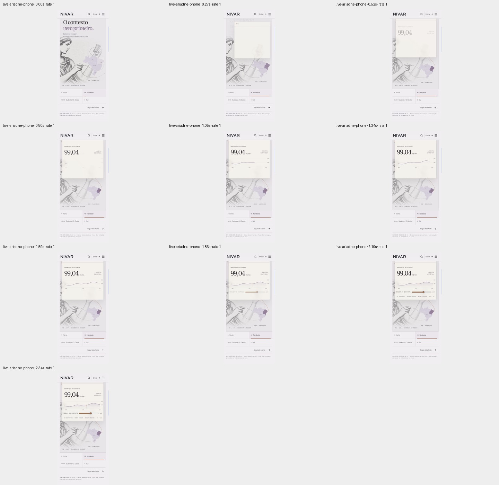
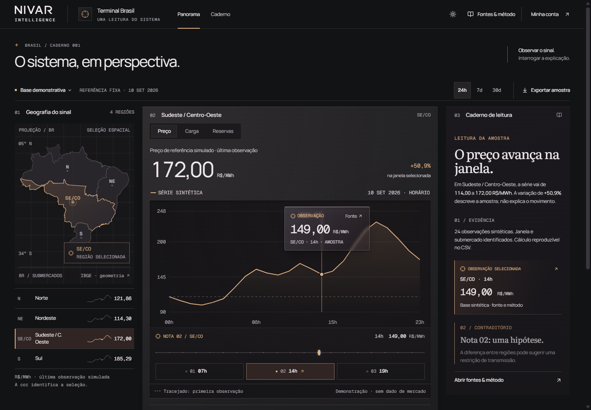
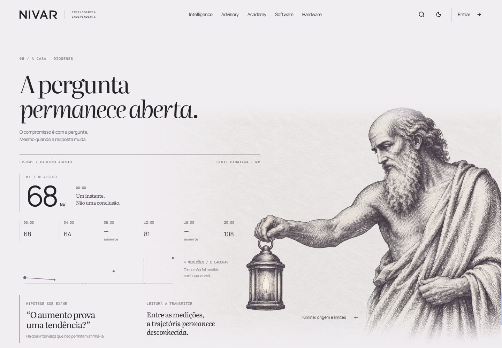
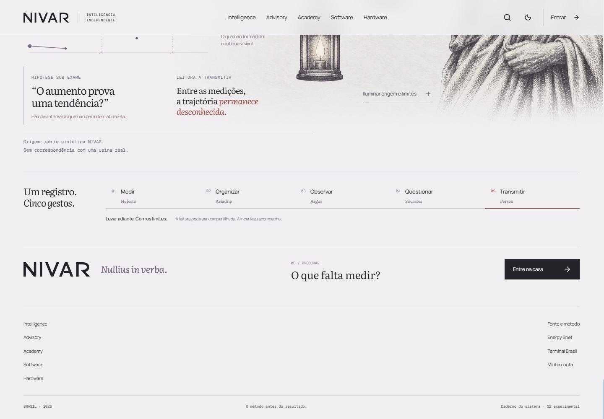

# Independent craft critique — Software, Terminal, Diógenes

Review date: 2026-09-11. Standard: strong studio-level visual and motion work, judged from the rendered experience, not from implementation effort.

| Piece | Meets the bar? | Largest visible craft gap |
|---|---|---|
| Software / Ariadne | **NO** | The sequence introduces and fills panels in stages; it does not yet make the observation feel like one continuous object becoming an instrument. |
| Terminal public reveal + standalone instrument | **NO** | The public reveal is a text banner. It withholds the very instrument that is the strongest part of the work. |
| Diógenes finale | **NO** | Its strongest composition is an intermediate section. The illustration leaves, then notes, a five-step strip, and a conventional footer dilute the ending. |

These are not equally far away. Terminal's standalone view is the most resolved. Ariadne has the most distinctive visual premise. Diógenes needs the largest change in composition and pacing.

## 1. Software / Ariadne — distinctive, not yet fluid enough

The engraving, pale violet map, fine thread, restrained serif type, and ivory source card belong to a recognizable family. The current phone region buttons are clear and comfortably sized. The dark source stage is a convincing change of tone. This is substantial visual authorship.

The weakness is the choreography. In the supplied phone recording, the card is nearly empty around 3.65–4.85 seconds; the useful number, chart, and control arrive later. A fresh live interaction is faster but still builds in separate beats: mostly empty panel at approximately 0.27 seconds, faint number at 0.52, partial line around 0.80–1.05, and slider becoming visible around 1.86 seconds. That reads as an animated assembly or load sequence. It delays the very relationship the user just asked to see.

The larger handoff repeats this pattern. At roughly 8.8–11.5 seconds in the desktop recording, the original chart and source card remain in their scene while a separate black dashboard appears below and the viewport moves into it. The selected observation does recur in the dashboard, but the eye has to rediscover its new location. In CRED, the card keeps an unmistakable spatial identity as it changes role; in MUST, the poster and sheet maintain a clear physical relationship during opening and dismissal. Ariadne's thread suggests that continuity more strongly than the motion delivers it.

**Visible correction:** Make region selection one concise transaction. Bring the number, chart, and usable control in with the arriving card; let the thread or marker provide the staged emphasis. As the instrument is revealed, visibly carry the existing observation card into the selected graph point while the map settles into its region rail. Compress or remove the abandoned source composition above it. A roughly half-second primary transition is a useful starting point for art direction, with a brief settling tail, rather than two seconds of separate arrivals.

Evidence: [live phone transition sheet](live-ariadne-phone-sheet-01.jpg), [desktop handoff sequence](ariadne-desktop-sheet-02.jpg), [full-size current phone chart](current-ariadne-phone-chart.png).

## 2. Terminal — strong instrument, underdeveloped public reveal

The full-size standalone desktop is the strongest screen in this review. The map, selected regional row, chart point, and reading panel agree visually. The gold line is precise and the primary number is easy to find. The editorial serif in the reading column is a useful counterpoint to the numerical interface. The phone view preserves a readable value and graph rather than squeezing the three desktop columns together. These are good craft decisions.

The normal-speed recordings show the selected region, point, time window, and reading changing coherently. The provenance drawer has a clear separate layer and a credible typographic hierarchy. It is an authored working instrument, not merely a dashboard-shaped picture.

The public reveal on `/br`, however, is only the dark heading panel with explanatory text and the entry link. The next Intelligence section begins immediately beneath it. There is no visual instrument reveal there. This is a material difference from the product-forward compositions in the current Linear reference. The visitor gets the claim that relationships are visible without seeing even one such relationship. Software eventually earns an embedded instrument, but the public Terminal section does not benefit from that visual proof.

**Visible correction:** Put one sharply cropped, readable Terminal composition inside the public reveal: selected region, one graph, one anchored observation. Reveal that observation first, then settle the regional comparison and reading rail around it. Keep the actual standalone typography and warm line treatment. Avoid a distant full-dashboard miniature; the selected value and its place on the curve should be legible before entry.

A secondary standalone refinement: the floating sample card, slider readout, and right-column sample card all compete with the same observation. Make the chart annotation lighter and compact enough to preserve the curve beneath it; let the reading column carry the more substantial card treatment. This matters most on the phone, where the tooltip takes a large bite out of the plotting area.

Evidence: [public reveal before](current-public-terminal-before.png), [public reveal after](current-public-terminal-after.png), [full desktop instrument](current-terminal-desktop.png), [full phone instrument](current-terminal-phone.png), [desktop interaction sequence](terminal-desktop-sheet-01.jpg), [phone interaction sequence](terminal-phone-sheet-02.jpg).

## 3. Diógenes — an attractive section, an unresolved ending

The illustration has presence and the large question has a good relationship to the figure. At the full desktop section, the lantern and the evidence line coexist attractively. Its imagery is recognizably related to the other family pages.

The ending does not concentrate that energy. In the supplied desktop recording, the title begins leaving the viewport around 2.2 seconds. The figure then leaves while the evidence notes expand, followed by the five-gesture strip and the footer. On the phone, Diógenes has already scrolled away by the time the explanatory note and final actions arrive. The last screen is mostly a small step selector, a brand row, and links. The most memorable object is absent from the moment intended to close the experience.

Podium supplies a clear comparison: its closing object remains the dominant center of the scene, and its main invitation occupies that same scene. The object continues to hold attention after the transition has finished. Diógenes gives the visitor another worksheet to read, then ends somewhere else. A light, intellectual ending could meet the bar; it does not need Podium's black background or its rock. It does need comparable concentration and a completed final composition.

**Visible correction:** Keep the figure and lantern present through the last meaningful action. Use the lantern's illumination to reveal one concise evidence statement or source aperture, then resolve the final question and entry action beside it. Move the detailed provenance and five-gesture recap into an optional expansion or earlier section. On phone, reserve one deliberate final composition containing the lantern, question, and action together; do not let the image disappear several screens before the ending.

Evidence: [desktop motion sequence](finale-desktop-sheet-01.jpg), [desktop trailing sections](finale-desktop-sheet-02.jpg), [phone trailing sections](finale-phone-sheet-02.jpg), [current Diógenes composition](current-finale-desktop.png), [current actual ending](current-finale-end.png), [Podium closing sequence](reference-podium-close-sheet-01.jpg).

## External evidence and limits

- [CRED reference](https://60fps.design/shots/cred-credit-card-full-page-offers-swipe-interaction): its 7.55-second video was played at rate 1, start to end, with consecutive timestamped screenshots.
- [MUST reference](https://60fps.design/shots/must-movie-detail-sheet): its 12.42-second video was played at rate 1, start to end, with consecutive timestamped screenshots.
- [Dovetail](https://dovetail.com/): current page inspected and captured. Its current hero reads “Build with facts, not vibes,” using a large central composition and a blue sculptural key.
- [Fey](https://www.fey.com/): **the current page is a “Fey joined Wealthsimple” announcement, with sign-ups closed.** It is not evidence of the former Fey product or motion. No former Fey motion is claimed or scored here.
- [Linear](https://linear.app/): current page inspected and captured; the product interface is a substantial part of its hero composition.
- [Podium](https://podium.global/): live closing scene inspected and captured. The explicitly supplied 6.83-second closing recording was also played at rate 1 from start to end.

All six supplied current recordings were played from start to end at `playbackRate: 1`, without seeking during capture. Consecutive frames were captured approximately every 0.25–0.55 seconds including intermediate states, and the resulting ordered sheets were visually inspected. Playback timestamps and paths are stored in `*-playback.json`; the overall inventory is `playback-index.json`. This is temporal visual evidence, not an instrumental frame-pacing test; no claim about exact refresh-rate smoothness or dropped frames is made.

The live public banner, standalone Terminal at 1440×1000 and 390×844, Software phone selection, and final Diógenes composition were independently captured in this run. The supplied family contact sheet was viewed for family consistency only. No product implementation, builder rationale, tests, previous critiques, or README notes were read. Only the authorized browser capture helper and general audit skill instructions were read.

Visible accessibility risks are secondary-label contrast and the amount of fine metadata, especially over pale or dark backgrounds; these deserve measured contrast checks. The graph's tooltip also obscures data on the phone. This craft review does not establish keyboard, screen-reader, reduced-motion, or WCAG compliance.

No product files or git state were changed.
