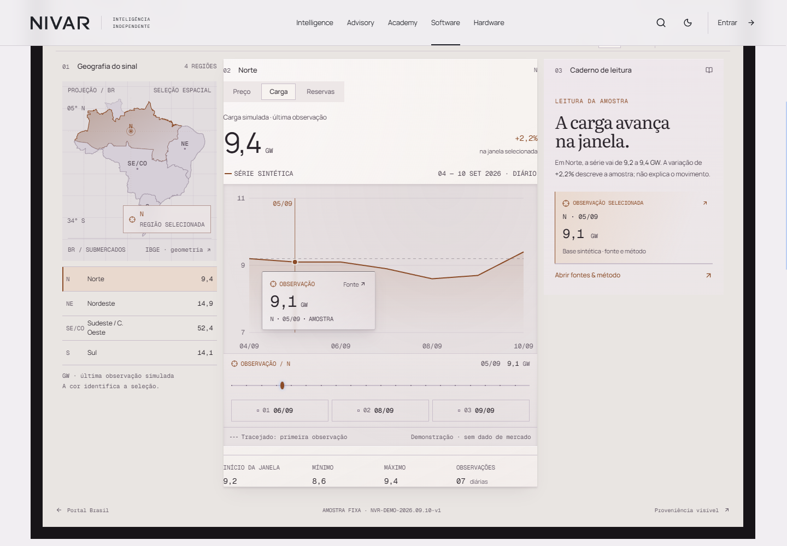
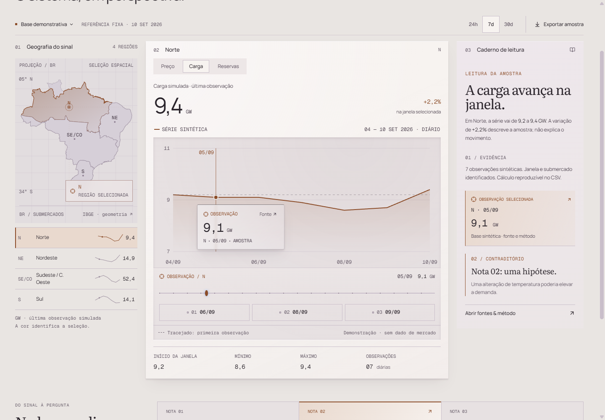
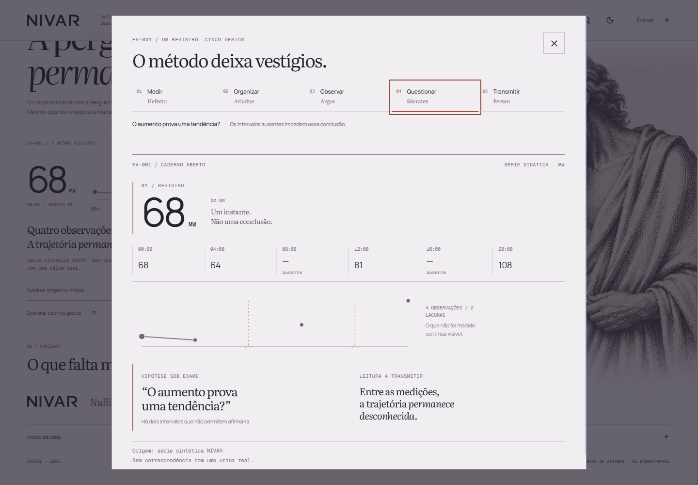
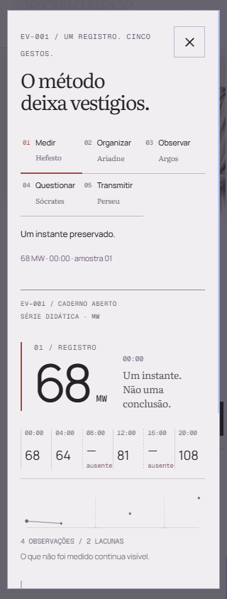

# G2.2 fresh SYSTEM critic — amendment to 01

**Current system verdict: YES for all five reviewed pieces. No unresolved high or medium system blockers in this bounded recheck.**

This amendment supersedes the current verdicts in [system-01.md](system-01.md). It preserves that report, its M1 failure and its evidence. Independent source inspection and real native pointer/keyboard input were used on `http://127.0.0.1:4173` between approximately **20:28 and 20:34 America/New_York on 11 September 2026**. No builder test reports were used. No product edits or Git writes were performed by this critic. [Final source hashes](system-01-amendment/final-source-hashes.json).

| Piece | Amended system verdict | Evidence |
|---|---|---|
| Hero iteration 05 | **YES** | Manual Procurar holds at 16.250 with visible open-question content; play crosses the native 18-second loop back to Medir. |
| Software / Ariadne | **YES** | M1 fixed. A subsequently found reduced-motion idle-loop defect, M2, was fixed and independently rechecked. |
| Public Terminal presentation, including new threshold | **YES** | Region, hour, source disclosure and current-observation entry work on desktop and mobile. No full Terminal mounts merely to render the threshold. |
| Standalone Terminal | **YES** | Current region, metric, period, source mode, observation and theme survive entry. Unavailable data remains unavailable. |
| Diógenes finale | **YES** | Native five-gesture dialog, Enter selection, Escape focus return, source opening/closing and narrow layouts work. |

## M1 closed — expansion now preserves the edited instrument

The original failure remains in [system-01/followup-evidence.json](system-01/followup-evidence.json) and its before/after screenshots.

The amendment repeated that workflow: start the journey with Sul, reveal the instrument, then change its controls to **Norte / Carga / 7d / 05 September / 9,1 GW / paper theme**. Its expansion link now becomes:

`/br/terminal?region=norte&period=7d&metric=load&source=sample&tone=paper&note=1&observation=1`

After the real click, the full Terminal retains every listed field and the source context remains `2026-09-05`. The same test with source mode changed to **unavailable** retains Norte, Carga, 7d and paper while keeping the curve absent, export disabled and the source dialog at `— GW / sem observação / Nenhum valor de mercado conectado`.

The receiving parser accepts known fixture regions, periods, metrics, source modes and themes; observation bounds come from the selected fixture window. It does not accept a value or an API from the URL. The current URL is produced by the Terminal that owns the edited state and passed back to Ariadne.

Source: `TerminalBrasil.tsx:221–228`, `:1208`, `:1213`; `AriadneJourney.tsx:280`. Runtime: [M1 before/after evidence](system-01-amendment/recheck-evidence.json).

## M2 found and closed during this amendment — reduced-motion entry kept polling

The first amendment run found a separate medium performance defect in the newly added Ariadne entry effect. The reduced-motion early return did not mark entry complete. Later URL changes reset the entry guard. Selecting unavailable data removed `.g2t-context-plane`, after which `enter()` continued calling `requestAnimationFrame` to find it indefinitely.

An observation-only wrapper counted the exact `enter` callback **93 → 308 times over a 900 ms idle interval** after the source became unavailable. It did not change the callback behavior. This failure is retained in [recheck-evidence.json](system-01-amendment/recheck-evidence.json), entries `reduced-raf-start` and `reduced-raf-end`.

The parent corrected the effect. Current code depends on readiness rather than every URL update, marks reduced/no-transfer entry complete, and gives missing-destination retries a 1200 ms deadline. The independent repeat then recorded **no requested callbacks at either end of a 1100 ms idle interval**, zero animations, `source=unavailable`, and `handoff=false`. Ordinary motion-enabled entry still delivered **Sul / 14h / 160,39 R$/MWh**, then removed the transfer element (`transferCount=0`).

Source: `AriadneJourney.tsx:64`, `:75–86`, `:108`. [Final independent evidence](system-01-amendment/final-recheck-evidence.json). M2 is closed on this snapshot.

## New public Terminal threshold

Desktop test at 1440×1000:

1. Scroll to the threshold: `data-entered=true`, zero full `.g2-terminal` elements.
2. Click **Sul**, use the range with Home and two ArrowRight presses: **02h / 118,99 R$/MWh**, timestamp `2026-09-10T02:00:00-03:00`.
3. Open “Voltar à origem”: native details expose the fixture version and explicit limits—synthetic, not PLD, executable price or forecast.
4. Click “Continuar desta observação”: full Terminal opens **Sul / price / 24h / index 2**, with the same 118,99 and timestamp in its source context.

Mobile test at 390×844 with reduced motion: choose **Nordeste**, use End to select **23h / 114,30 R$/MWh**, open the source, then enter. The full instrument retains Nordeste / 23h / 114,30. Threshold animation count is zero; page/body width is 390 and its expanded details stay within the component.

Source: `TerminalThreshold.tsx:64`, `:67`. [UI evidence](system-01-amendment/ui-evidence.json), [desktop threshold](system-01-amendment/03-threshold-desktop.png), [mobile threshold](system-01-amendment/05-threshold-mobile.png).

## Changed Diógenes finale

“Examinar os cinco gestos” opens a native modal dialog labeled by its heading. Initial focus goes to “Fechar caderno.” Four Tab presses reach Sócrates; a native Enter selects it, sets the fourth `aria-pressed=true` and reads **“O aumento prova uma tendência? / Os intervalos ausentes impedem essa conclusão.”** Escape closes the dialog and restores focus to `.g22-finale-notebook-open`. No background-page control received Tab focus; the browser's own focus cycle can briefly report the body before returning to the dialog.

The source control changes `aria-expanded`, reveals the EV-001 synthetic origin, 00:00–20:00 and missing 08:00/16:00, then hides it on the next click. The dialog retains `[68, 64, —, 81, —, 108]`. Pointer selection of Perseu also updates the reading.

Measured layout:

| Viewport | Dialog bounds | Horizontal content | Source/closing layout |
|---|---|---|---|
| 1440×1000 | x=230, y=32, 980×936 | Within viewport | Source opens/closes without page-width growth |
| 390×844, reduced | x=10, y=14, 370×816 | scrollWidth=clientWidth=366 | Source ends at y=581.44; closing resolution starts at y=641.44 |
| 320×844, reduced | x=10, y=14, 300×816 | scrollWidth=clientWidth=296 | Page width=320; source width=278, scrollWidth=276 |

Reduced-motion finale/dialog animation count is zero. This verifies reflow and native keyboard behavior; it is not a full assistive-technology certification.

Source: `HouseFinale.tsx:58`, `:66`. [Final keyboard and narrow-layout evidence](system-01-amendment/final-recheck-evidence.json).

## Hero bounded recheck and evidence limits

The final manual chapter selector seeks Procurar to **16.250** seconds, pauses it, and produces `opacity=1`, `visibility=visible` for the open-question content. Playing from there crosses the 18-second boundary to **0.425 / Medir** in the successful UI run. `HeroFilm.tsx:93` contains the six deliberate manual seek points. The earlier system checks for reduced motion, offscreen/background suspension, exact series and independent image provenance remain applicable; this amendment did not repeat licensing research or judge mask aesthetics.

All screenshots cited above were opened and inspected. Successful final UI runs recorded no uncaught product exceptions; the observed `/api/auth/me` 401 responses are the anonymous context already described in system-01. Full-source gates, authenticated business workflows, cross-browser/assistive-technology coverage and visual craft remain outside this bounded amendment.

Harness corrections are preserved for clarity: the initial threshold selector counted a non-button sibling, and the first native Enter event lacked its character payload. The final controls were targeted by exact region labels and keyboard events included their virtual key codes plus Enter's native carriage-return payload. The initial non-activation is not a product finding. The native dialog Escape behavior and Enter activation both passed with complete events.
