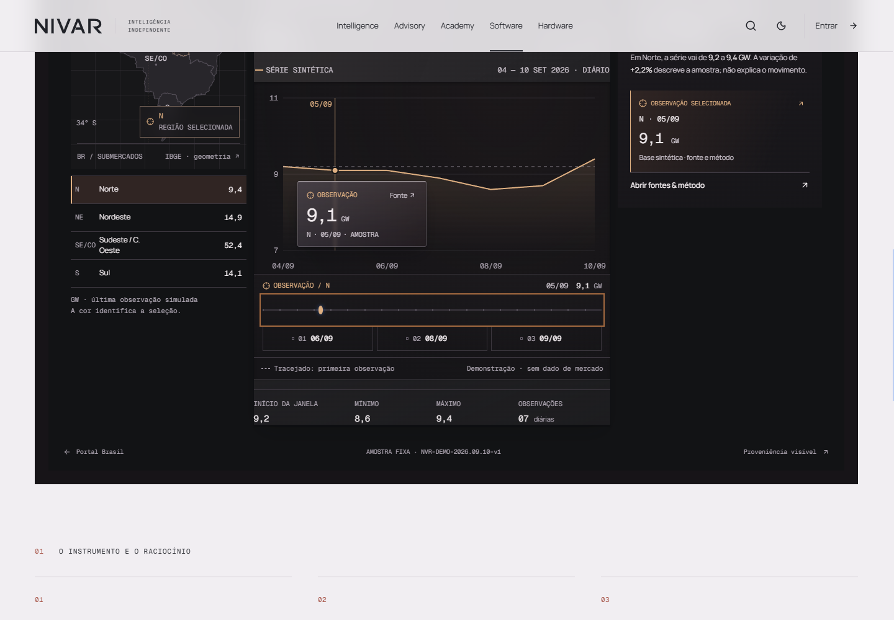
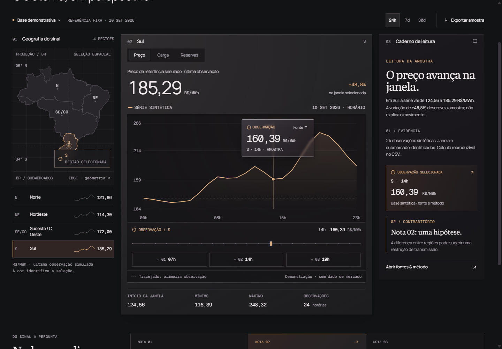

# G2.2 fresh SYSTEM critic — 01

Review against `06c7d35c8bed780000a884fa58285e9916ed0f61`. No product edits, commits, merge, or deploy performed by this critic. The repository remained at that HEAD with additional G2.2 working-tree changes.

Source and browser review on 11 September 2026, approximately 19:55–20:15 America/New_York. The main browser evidence was captured at **00:07–00:10 UTC on 12 September**. Root was iterating the hero concurrently. A separate final bounded recheck covers the new **18-second** hero; the earlier 36-second screenshots are retained as history. The handoff failure below was captured at **00:09:36 UTC**, before the assigned corrective work. See JSON timestamps and [source hashes](system-01/source-snapshot.json).

## Verdicts

| Piece | System verdict | Reason |
|---|---|---|
| Hero film | **YES** | Synthetic evidence and historical photographs remain distinct; pause, background/offscreen suspension, chapter controls, reduced motion, responsive sources, and the new 18-second return work in the tested browser. This does not approve its cinematography. |
| Software / Ariadne | **NO** | The initial journey passes real selected fixture state into the instrument, but expanding the instrument after editing it loses the current context. M1 below. |
| Terminal public presentation | **NO** | Progressive mounting is real on both public surfaces; the same M1 interrupts the final entry into the full instrument. |
| Standalone Terminal | **YES** | Region/metric/period/observation changes, provenance context, unavailable state, valid/invalid entry parameters, source-dialog focus, and reduced-motion behavior pass the bounded checks. |
| Diógenes finale | **YES** | Preserves the series, gaps and limits; family controls and origin disclosure work, and the mobile disclosure reflows without overlap. |

**High blockers: none found. Medium blockers: one, shared by two pieces.**

## M1 — Full-screen entry discards changes made in the earned Terminal

**Affected source at failure:** `src/components/g2/AriadneJourney.tsx:215`, plus the independently owned Terminal state in `src/pages/terminal-brasil/TerminalBrasil.tsx:165` and following state declarations. The outer “Abrir em tela inteira” link serializes the earlier Ariadne `region` and `selectedIndex`. The interactive embedded Terminal has its own region, metric, period, source and probe state; changes there do not reach that outer link.

Reproduced with real pointer clicks and keyboard range input:

1. Open `/br/familia/software`, choose Sul, follow the origin, reveal the Terminal.
2. In the earned Terminal select **Norte → Carga → 7d → 05/09**. The selected observation is **9,1 GW**.
3. The visible full-screen link still points to `/br/terminal?region=sul&observation=14`.
4. Click it. The full page shows **Sul → Preço → 24h → 14h**, **160,39 R$/MWh**.

This changes the meaning of the observation during what the interface presents as an expansion of the instrument. Preserve the current embedded selection, including period, metric, source mode and inspected observation, or put the expansion control inside the state owner. Retest after changing the embedded instrument, not only after changing the preceding Ariadne card.

Evidence: [raw before/link/after states](system-01/followup-evidence.json), [reproduction harness](system-01/followup.mjs).

The parent acknowledged this finding and assigned a fix. That assignment is not treated as a pass. Preserve these failure captures when adding a recheck.

## Independently verified behavior

1. **Hero and provenance.** All three hero photographs loaded with `naturalWidth=1800` on desktop. The film mounted zero video elements. Mobile switches to the three `-mobile.webp` sources. The method series is `[68, 64, null, 81, null, 108]`; the rendered values preserve the missing slots, and the only connected segment joins the first two supported observations. The HTML transcript states the synthetic series is independent of Itaipu. The public credits page loaded all images and exposes author, original page, license and alterations.

   The primary Wikimedia records independently match the credits: [aerial photograph](https://commons.wikimedia.org/wiki/File:Itaipu_Dam,_aerial_photograph.jpg), acediscovery, 2 January 2013, CC BY 4.0; [control room](https://commons.wikimedia.org/wiki/File:Itaipu-Wasserkraftwerk_Kontrollraum.JPG), Anagoria, 20 November 2010, CC BY 3.0 as one available license; [power lines](https://commons.wikimedia.org/wiki/File:Power_lines_and_Itaipu_lake_(8155778229)_(2).jpg), Leandro Neumann Ciuffo, 4 November 2012, CC BY 2.0. The latter record explicitly places the pylons on the Paraguay side, which the shipped credits and transcript preserve. No named plant is presented as the source of the synthetic values.

2. **Playback controls and visibility.** In the main run, pause held exactly `1.058` seconds through the wait; offscreen playback held `4.633`. A real second browser tab made `document.hidden=true`; the clock held at `0.500`, then resumed to `0.796` when activated again. Reduced motion initially produced a static question chapter and no active animations. In the final 18-second version, chapter six sought to `17.250`; after play the clock crossed the loop to `0.563`, chapter `medir`, with the six values unchanged. Pause then held `0.746`. Enabling reduced motion held `11.000`, `playing=false`, zero animations. References: `HeroFilm.tsx:77`, `:80`, `:85`, `:92`, `:119`; [main evidence](system-01/browser-evidence.json), [visibility evidence](system-01/visibility-public-evidence.json), [18-second recheck](system-01/export-and-hero-recheck.json).

3. **Progressive public reveal and initial data handoff.** Both `/br` and `/br/familia/software` have zero `.g2-terminal` elements before reveal, including phase 2 with origin visible. Revealing mounts one instrument. On the family page, Sul / 02h / **118,99 R$/MWh** appears unchanged in the card, chart context, reading trace and source dialog. Initial full-screen entry also preserves it in the version tested. On `/br`, Norte / 14h reaches the instrument as **105,86 R$/MWh**. This is actual fixture data handoff, not a matching screenshot. References: `AriadneJourney.tsx:28`, `:128`, `:215`, `TerminalBrasil.tsx:165`, `:202`.

4. **Terminal state truth.** Selecting 05/09 in the 7-day Sul price series gives **162,71 R$/MWh**. Moving to 30 days retains 05/09 and 162,71 while the probe index changes from 1 to 24. Source inspection retains Sul, Preço, the same value, `2026-09-05`, and the fixture version. Switching to “Fonte indisponível” removes the curve and selected-observation trace, displays dashes, disables both export controls, and reports “Nenhum valor de mercado conectado” in the source context. No stale synthetic value remains in that context. Unknown region and negative observation entry parameters safely fall back to the default selection. References: `TerminalBrasil.tsx:254`, `:280`, `:1127`; [evidence](system-01/browser-evidence.json).

5. **Export content and motion boundary.** A real export-button click created a CSV Blob with 24 Sul observations, explicit `DEMONSTRACAO_SINTETICA`, version, submarket, window, metric, timestamp and units. The captured Blob includes 02h `118.99`, 14h `160.39`, and final `185.29`, matching rendered values. The browser download-file check was inconclusive, so this verifies the actual generated CSV content, not the OS save dialog. [Captured CSV](system-01/actual-export.csv). `terminal-motion.ts` changes presentation geometry only; it does not write interpolated values into data, source records or export. Runtime markers include the expected distinct horizontal baseline and vertical probe; no malformed SVG coordinates appeared. Reduced-motion Terminal states had zero animations.

6. **Keyboard and responsive behavior.** Ariadne range inputs respond to Home/ArrowRight and retain exact hourly selection. Its hidden initial record is `inert`; source content is inaccessible until its phase opens. Conditional action replacement releases focus to the body, but the next Tab continues locally to the new back/review control, not to the page header. This is a minor focus-polish opportunity, not a blocker in the tested keyboard path. The source dialog moves focus to its close button; Escape closes it and returns focus to the invoking observation trace. The mobile dialog measured exactly `390×844`, with scrollable content. At `1440×1000` and `390×844`, body/root widths equal the viewport and no broken image was found. Light/paper and dark/graphite states were inspected. The finale intentionally retains its light sheet within the dark Portal; its heading remains dark and legible.

7. **Finale.** The five family controls update `aria-pressed` and their reading. The “Iluminar origem e limites” control updates `aria-expanded` and reveals a real HTML aside. Its text declares synthetic EV-001, 00:00–20:00, missing 08:00 and 16:00, and no claim about a real installation. The mobile source note ends at y=584.53 and the next traces begin at y=618.53. Reduced-motion finale animation count is zero. The final “Entre na casa” route remains `/criar-conta`; compact footer retains all family, method, brief, Terminal and account links. References: `HouseFinale.tsx:65`, `:99`, `:102`, `NivarShell.tsx:204`.

8. **Protected boundaries.** The tracked diff from 06c7d35 does not change backend, route configuration, auth clients, API contracts, shared data/types, Alexandria, package configuration, Vite proxy or Vercel rewrites. New CSS uses dedicated G2/G22/Terminal selectors. A browser visit to `/alexandria` found zero G2 shell/Terminal/finale roots and its heading still computed `Cinzel, serif`. No Alexandria game or curriculum test was repeated. Anonymous requests still use relative `/api/auth/me` and return the expected 401; no runtime exceptions were recorded in the reviewed flows. Authenticated business workflows were not exercised because they were untouched and the audit used isolated anonymous browser contexts.

## Capture index and limits

The report uses current-run evidence only. Source inspection and real pointer/keyboard input were used together. Screenshots listed here were opened before acceptance.

| Step | Capture |
|---|---|
| Hero supported observations and gaps | [01 desktop question](system-01/01-hero-question-desktop.png), [08 mobile reduced](system-01/08-hero-reduced-mobile.png), [19 new 18-second paper](system-01/19-hero18-paper-mobile.png) |
| Ariadne observation → origin | [04 observation](system-01/04-ariadne-observation-desktop.png), [05 origin](system-01/05-ariadne-origin-desktop.png), [11 mobile origin](system-01/11-ariadne-origin-mobile.png), [18 Portal origin](system-01/18-public-origin.png) |
| Earned Terminal → provenance | [06 desktop](system-01/06-earned-terminal-desktop.png), [12 mobile](system-01/12-earned-terminal-mobile.png), [14 mobile source](system-01/14-terminal-source-mobile.png) |
| Diógenes disclosure and modes | [03 desktop source](system-01/03-finale-source-desktop.png), [09 mobile figure](system-01/09-finale-mobile.png), [10 mobile source](system-01/10-finale-source-mobile.png), [17 dark Portal](system-01/17-finale-night.png) |

This is a bounded system acceptance review, not a full WCAG certification, cross-browser compatibility matrix, performance trace, authenticated-flow regression suite, or craft approval. No Safari or assistive-technology session was available. The initial harness needed correction for smooth-scroll coordinates and the dialog selector; those harness errors were investigated and are not reported as product defects. The final evidence files contain successful observations and no uncaught product exceptions.
