# Current G2.1 targets

These are **problem targets**, not references to preserve.

## 1. Portal opening

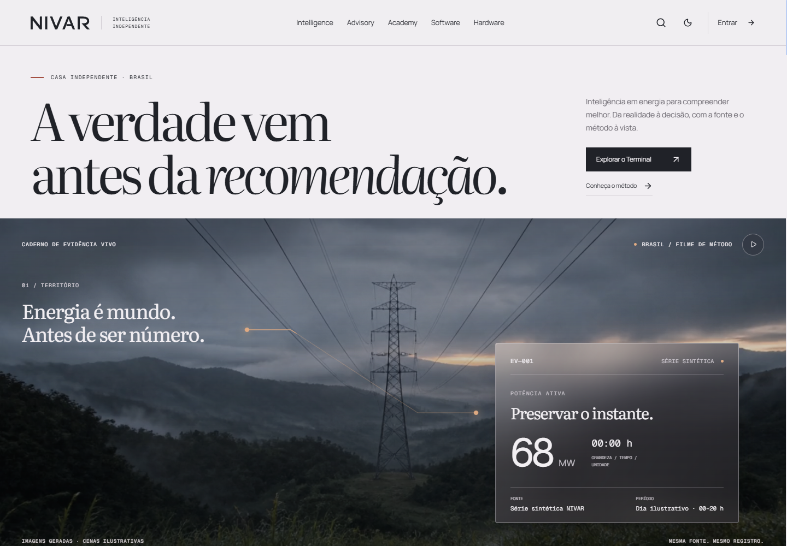

Keep: strong thesis, large editorial voice, clean hierarchy.
Attack: film needs more causal motion, real Brazilian imagery, stronger cinematic build, better persistent visual thread.

## 2. House Software / Terminal

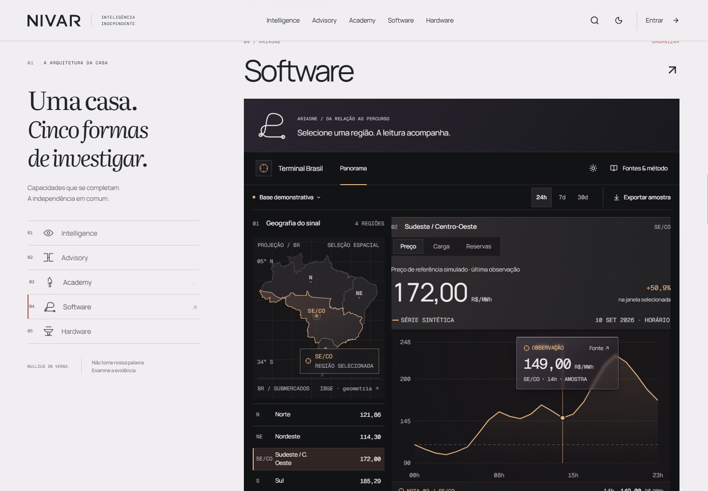

Keep: light-to-dark concept and real working Terminal.
Attack: Terminal is exposed too fully and too early. Ariadne should *create the path into the product*. Build the product from partial states, shared elements, selection propagation, and causal reveal.

## 3. Diógenes closing

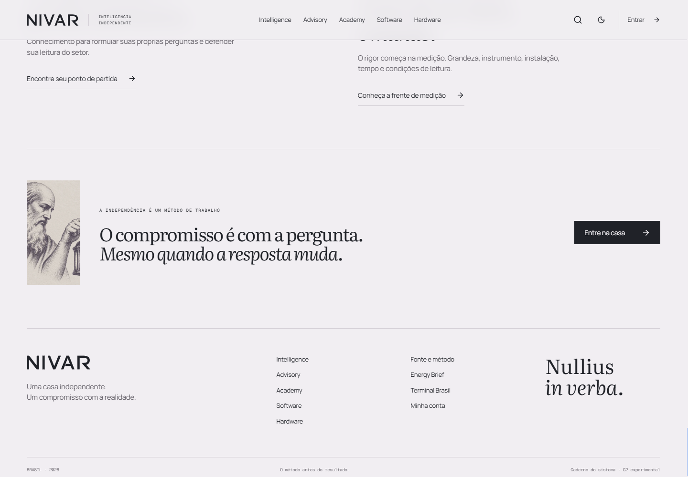

Keep: philosophical thesis and quiet confidence.
Attack: Diógenes is visually weak and clipped, family system is absent, close does not gather the whole house. Closing should synthesize the six verbs and leave a memorable image.

## 4. Family utility symbols

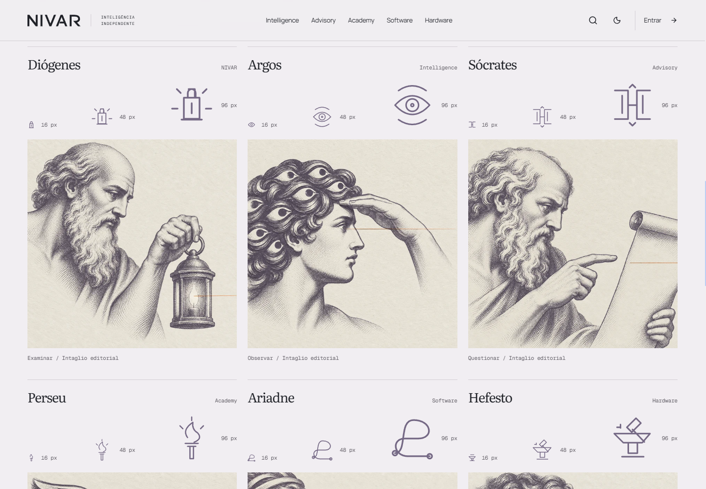

Keep only if useful as navigation-scale glyphs.
Attack: they must not carry emotional brand identity. Ariadne's micro mark is especially weak. Hero/ceremonial identity should come from large character art, meaningful gesture/object fragments, motion signature, material, and composition.

## 5. Software / Ariadne

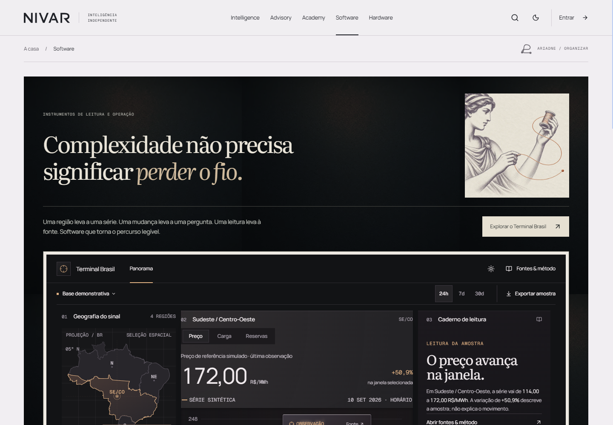

Primary current weak point. It reads as a dark product showcase with an editorial image, not as complexity becoming navigable.

## 6. Intelligence / Argos

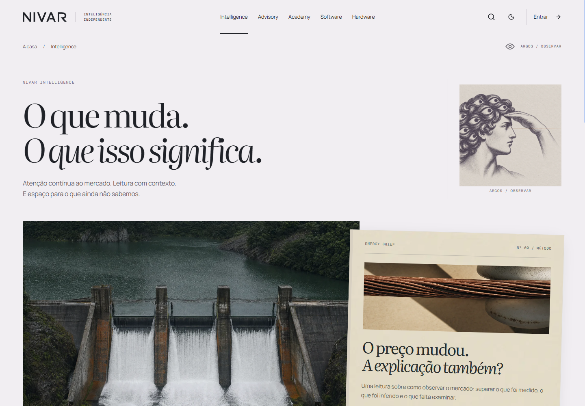

Direction is strong. Push publication motion, signal observation, real provenance, and a more active relationship between Argos and the publication object.

## 7. Advisory / Sócrates

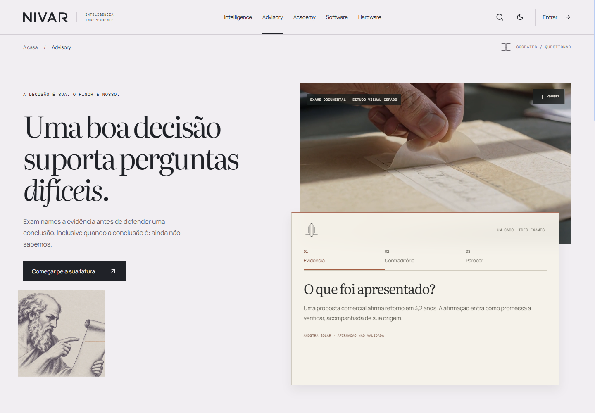

One of the strongest directions. Use as an internal quality reference: claim and evidence already have visible tension.

## 8. Academy / Perseu

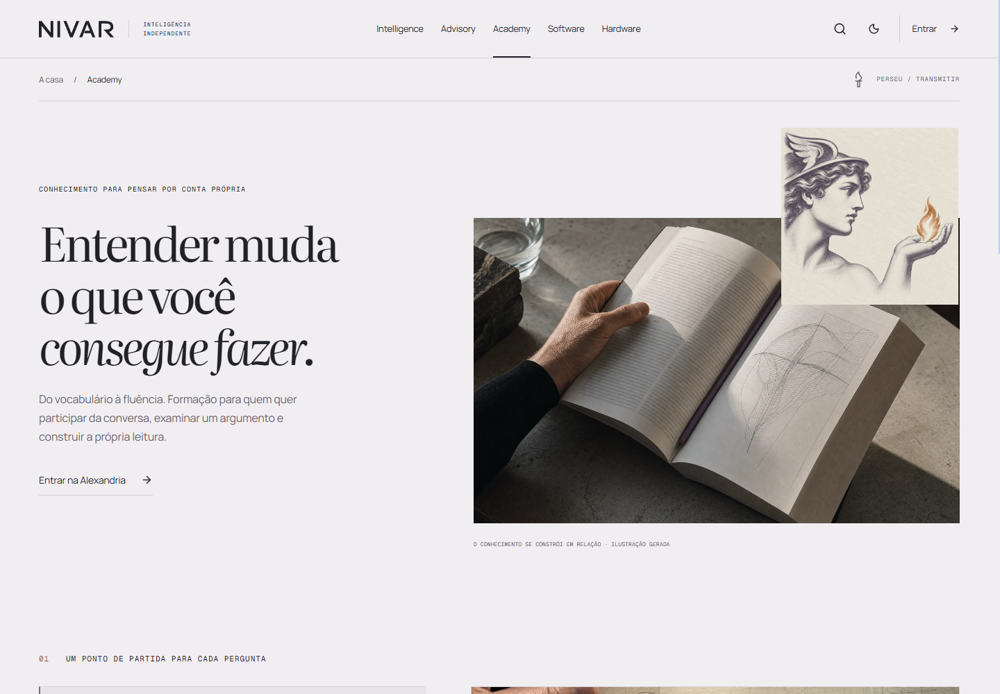

Elegant but less memorable. It needs a stronger visual act of transmission/progression, not only a beautiful reading scene.

## 9. Hardware / Hefesto

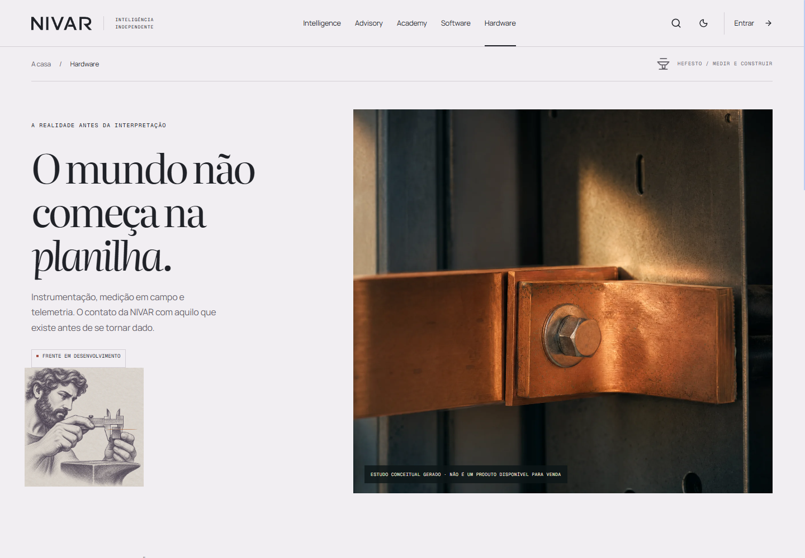

Another strong internal reference. Physical scale, copper, material, and measurement make the family legible without Greek theming.

## 10. Terminal

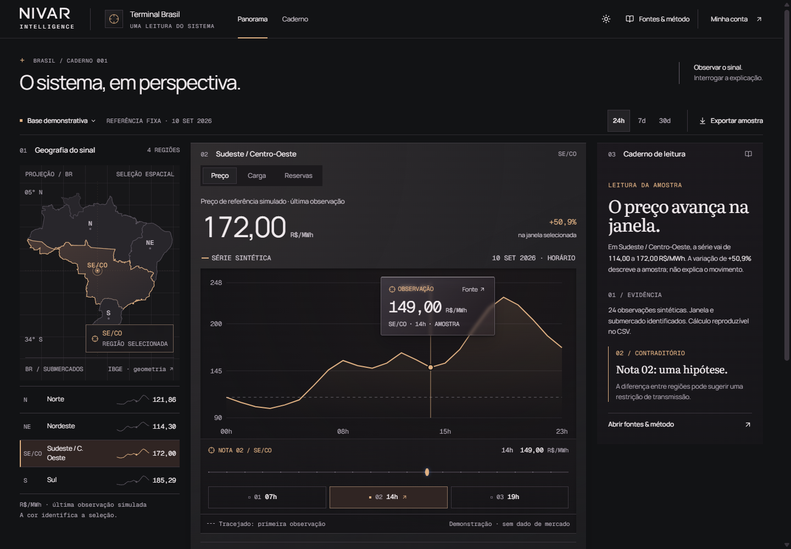

Strong base. Next gap is desirability and motion, not information architecture. Selection should propagate with more authority, charts should morph, probe/source layers should feel materially distinct, and map/time/source should remain causally connected.

## 11. Current hero filmstrip

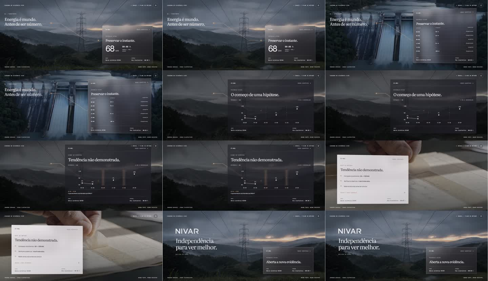

Keep the six-verb narrative. Rebuild the cinematic language around one persistent evidence object and semantic transformations instead of background clip + finished panel + next clip.
