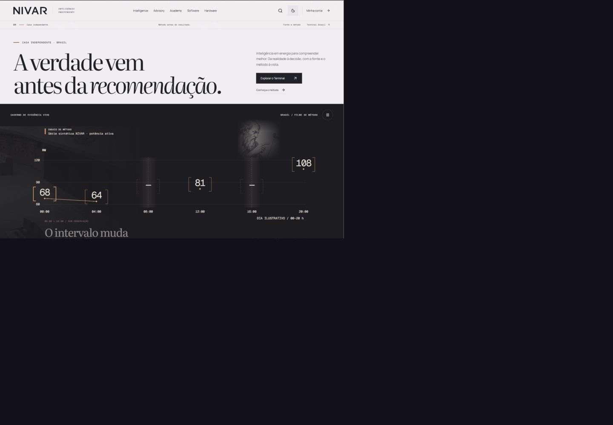
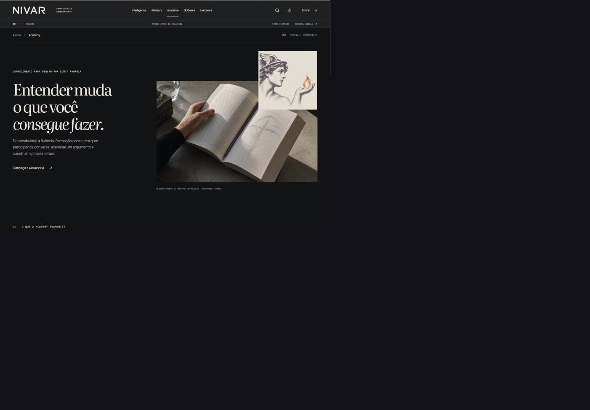
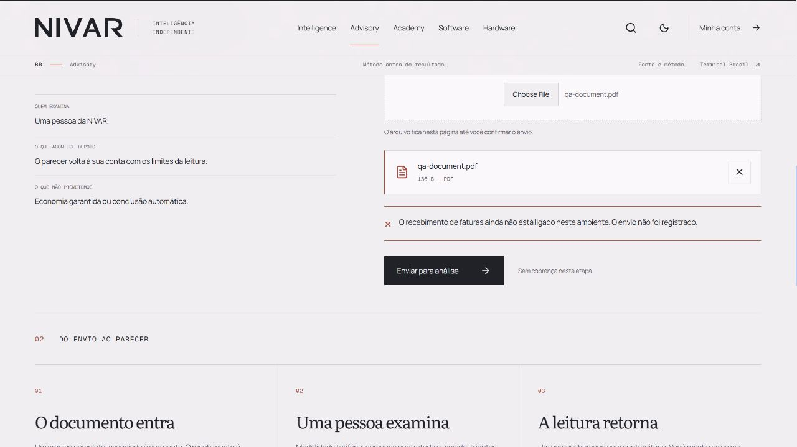
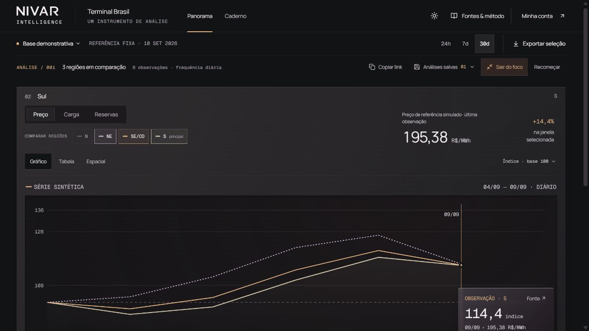

**NIVAR — fresh craft review, 12 September 2026**

NIVAR feels authored. The large, narrow serif headlines, carefully chosen italic phrases, quiet technical labels, copper accents, and physical energy imagery establish a recognizable editorial voice. The portal, Hardware opening, and Advisory premise sample feel professional. The client interactions are less finished than those openings. The distinctive character currently lives more in the compositions and material palette than in the wordmark itself.

This is a visual critique of the supplied current renders. I did not read implementation, source, project history, design rationale, or test reports. I inspected the native 1280-wide client screenshots named `hardware-native-replay-paused.png`, `solar-native-anon-access.png`, and `conta-luz-native-synthetic503.png`, the native terminal screenshot, the wordmark contact sheet, and the supplied desktop/mobile family and client images. The nonnative captures show a reduced page at the top left with dark padding outside it. That padding is a capture limitation, not a design defect; those captures support composition and content judgments but cannot establish actual text size, touch-target size, or precise contrast. Some screenshots begin midpage. I do not treat content cut by the viewport as a layout defect.

**External reference used**

I read IBM Carbon’s current [Typography: Style strategies](https://carbondesignsystem.com/elements/typography/style-strategies/) and [Type sets](https://carbondesignsystem.com/elements/typography/type-sets/), and visually inspected its [account creation composition](https://carbondesignsystem.com/static/f485a06d902eecd5175f94701e5a6938/3cbba/productive-in-expressive-URX.png). Carbon gives expressive reading moments and compact task moments distinct hierarchies; its account example visibly gives the functional form its own clear region beside the expressive introduction. Its type guidance distinguishes body copy from small labels rather than asking one tiny style to carry both roles.

My comparison is about that discipline, not adopting IBM’s appearance. NIVAR’s serif and copper language has its own character. The useful benchmark is whether a customer can move from that expressive language into an equally resolved form or instrument. The physical texture is stronger in NIVAR than in the deliberately flat Carbon example; the separation of functional levels is clearer in Carbon.

**1. BRAND / WORDMARK / HEADER — authored composition; identity not fully resolved**

The portal headline has conviction. Its two-line composition gives the central belief proper weight, and the quieter action column keeps the page from becoming an undifferentiated poster. The move from pale editorial opening to dark evidence panel is effective. The compact copper observation brackets connect the page’s material language to the analytic subject.

The largest remaining gap is between the polished editorial voice and the relatively anonymous masthead. In the native Hardware and Solar captures, the heavy NIVAR name has substantial visual weight while the descriptor and second utility row are exceptionally delicate. The descriptor reads almost as texture. There is a great deal of hierarchy between the name and the actual family navigation, but comparatively little within the small navigation and utility language.

The contact sheet makes the options legible at several scales, which is useful. The left “Interval” study is the calmest and most transferable, but its individuality is subtle enough that the small version reads like a conventional uppercase sans. The middle “Abertura” study gains recognition through the angular R; at small size the abrupt corner draws disproportionate attention to the last letter. The serif “Incisão” has editorial authority, but competes with the same serif register used in the large page copy. None of these conclusions proves which drawing is deployed; the rendered headers remain the evidence for the live impression.

Concrete location: top-left lockup and the thin second header line in `hardware-native-replay-paused.png`; all three small-scale rows in `wordmark-contact-sheet.png`. Resolve the optical relationship among the name, descriptor, and navigation before adding further marks or decorative cuts. The wordmark should retain a recognizable detail at masthead size, with a descriptor that can actually be read.

**2. FAMILY IDENTITY — convincing shared house; some imagery still feels applied**

Intelligence, Advisory, Academy, and Hardware visibly belong together without relying on five unrelated colors. Intelligence connects observation to an energy landscape; Advisory stages a claim and its assumptions; Academy pairs a reader’s book with an illustrated figure; Hardware makes copper and measurement physically present. Hardware is the most convincing material expression because the subject, warm accent, and measurement idea reinforce each other.

The largest remaining gap is the integration of the classical figures into each composition. Hardware’s figure lies within the material scene, Advisory’s portrait recedes into its dark claim panel, Academy’s figure becomes a bright, square paper insert, and Intelligence’s figure becomes a faded backdrop. Those are potentially useful variations, but their current visual depth varies enough to feel partly assembled. In `intelligence430-light.png`, the face sits directly behind the headline and supporting-copy region. That is the weakest instance: the image and the reading plane compete. Academy’s floating rectangular portrait is exceptionally prominent relative to the book it overlaps.

Concrete location: upper half of `intelligence430-light.png`; top-right overlap in `academy1440-dark.png` and `academy430-light.png`; lower-left figure over copper in the native Hardware render. Establish a consistent relationship between illustration and reading space, then let the physical subject carry each family’s difference. On the Intelligence mobile composition, first move or crop the figure clear of the text column.

Software’s family page is not evidenced in the supplied set. The visible menu label does not establish its identity, so this is not an endorsement of all five families.

**3. ACADEMY / PRODUCT ENTRY — beautiful opening; the learning offer is elusive**

Academy’s headline is one of the strongest pieces of typesetting in the set. The line breaks and final italic phrase give the sentence cadence. The book image contributes touch, scale, and a human action that the more abstract house language needs. The mobile stack preserves the intended reading order.

The largest remaining gap is that the visible opening advertises an attitude toward learning more clearly than an actual learning product. “Conheça Alexandria” introduces another name before the screen establishes what the visitor will encounter there. Within the evidenced first viewport, there is no concrete course, sample lesson, learning path, or compact statement of who the first offer serves. The collage receives more visual emphasis than the actionable offer.

Concrete location: the text link beneath the introductory paragraph in `academy1440-dark.png` and `academy430-light.png`. Bring one concrete learning entry into this composition: a named starting point, its intended learner, and an action that states what opens. Keep the editorial headline, but give the visitor something specific to evaluate beside it. Content below the captured viewport may resolve this later; it does not resolve the opening visible here.

**4. ADVISORY / CLIENT — the argument is finished more convincingly than the upload**

The Advisory premise sample is the most persuasive demonstration of the house’s method. The quoted payback claim, three premise tabs, focused question, and restrained conclusion form an authored sequence. In the mobile costs state, the selected tab and copper side rule establish a useful hierarchy without adding decoration. The native Solar access state is also coherent: product status, account action, and the three-step process are clearly separated.

The largest remaining gap is the file submission module in `conta-luz-native-synthetic503.png`. In its upper-right region, an English “Choose File” control and filename sit above a second, styled file row containing the same filename. The native control appears visually disconnected from the carefully designed document row. Below it, the error explains that receiving invoices is not connected “neste ambiente.” That is implementation-facing language in an otherwise client-facing experience. The nonreceipt statement is clear and should remain clear; the customer also needs a useful next action.

Concrete location: native screenshot, upper-right file selector through the error strip and “Enviar para análise” action. Finish this as one Portuguese file-selection component: one authoritative selected-file presentation, a clear replace/remove action, readable helper text, and a failure message expressed in service terms. The polished editorial promises create a higher expectation for this handoff than the current module meets.

The diagnostic review screenshot has a sensible summary-before-send structure and a clear primary button. Its reduced capture is insufficient to judge small label legibility. No upload, submission, retry, authentication, or delivery behavior was exercised in this critique.

**5. ANALYTICAL INSTRUMENT — professional density; too many quiet levels compete**

The terminal has an appropriate change of register. The sans and monospace typography, explicit units, subdued regional colors, and thin lines communicate an analytical tool. Its restrained copper detail belongs to the same house as Hardware and Advisory. The primary value is easy to find, and the active focus action is visible.

The largest remaining gap is the stack of similarly weighted controls above the chart. In `05-native1280-dark-focus.png`, navigation, dataset/time selection, saved-analysis actions, region heading, metric tabs, comparison chips, and view tabs occupy several horizontal tiers before the plot begins. The individual rows are orderly, but the screen does not make their relative importance equally clear. There is also a close tonal relationship among page, analysis panel, tabs, and chart surface; the outer panel’s soft visual treatment adds atmosphere without improving that hierarchy.

Concrete location: top of the screenshot through the “SÉRIE SINTÉTICA” line. Tighten the relationship between metric selection, compared regions, and chart, and subordinate the occasional actions more decisively. Use fewer competing panel tones. The chart should be the most immediate working surface after the primary selection, while the source/context information remains legible.

The visible bottom of the tooltip is outside the screenshot. I cannot establish whether it is incorrectly clipped in the product, and I do not count it as a defect.

**6. GLOBAL / LIGHT / DARK / MOBILE — coherent materials; small information is too often treated as atmosphere**

The pale surfaces have a distinctive cool-paper quality, and the dark surfaces preserve warmth through ivory type and copper detail. The main headlines remain convincing across the evidenced themes. Mobile is visibly recomposed rather than simply showing the desktop columns in miniature. The Advisory costs panel and Hardware accordion retain a clear sequence.

The largest remaining gap is the visual importance of small information. In the native header, utility language is extremely fine; in the native Hardware media panel, illustration/status labels are much less prominent than the imagery; in the terminal, minor labels, units, and muted actions require deliberate attention. These details matter to an intelligence house because they qualify what the visitor is seeing. Their treatment sometimes makes them feel like art-direction texture.

Concrete locations: the second masthead row across native client images; text beneath “Continuar o estudo” in the Hardware media panel; small metadata and muted comparison options in the native terminal. Set a firmer readability floor for source/status language and task labels, and reserve the most delicate treatment for truly secondary decoration. This can be done within the existing aesthetic.

These are visible readability risks, not a measured accessibility failure. The supplied mobile and most dark family captures are reduced. I did not measure contrast, inspect semantic names, test keyboard focus, zoom, reduced motion, screen readers, or minimum touch targets, and cannot claim full light/dark/mobile parity.

**Highest-priority fix**

Finish the client upload module first. The native English picker, duplicate file presentation, and environment-specific error copy are the clearest concrete break in an otherwise authored experience. A unified Portuguese file-selection and failure state would make the moment where a client entrusts NIVAR with a document feel as considered as the promise that brought them there. Preserve the explicit statement that an unsuccessful submission has not been registered.

**Review sequence and health**

1. Portal, wordmark sheet, and native headers — strong composition; masthead individuality and secondary hierarchy need refinement.
2. Intelligence, Advisory, Academy, and Hardware family openings — coherent and recognizable; portrait integration is uneven. Software was not evidenced.
3. Academy entry — visually resolved; concrete learning offer is weak within the shown viewport.
4. Advisory example, product status, client upload, and diagnostic review — argument and process are clear; upload presentation is the clearest unfinished seam.
5. Terminal focus view — credible analytical tool; control hierarchy needs tightening.
6. Evidenced light, dark, and mobile compositions — coherent art direction; small information deserves a firmer readability floor. Functional and accessibility parity remain unverified.
