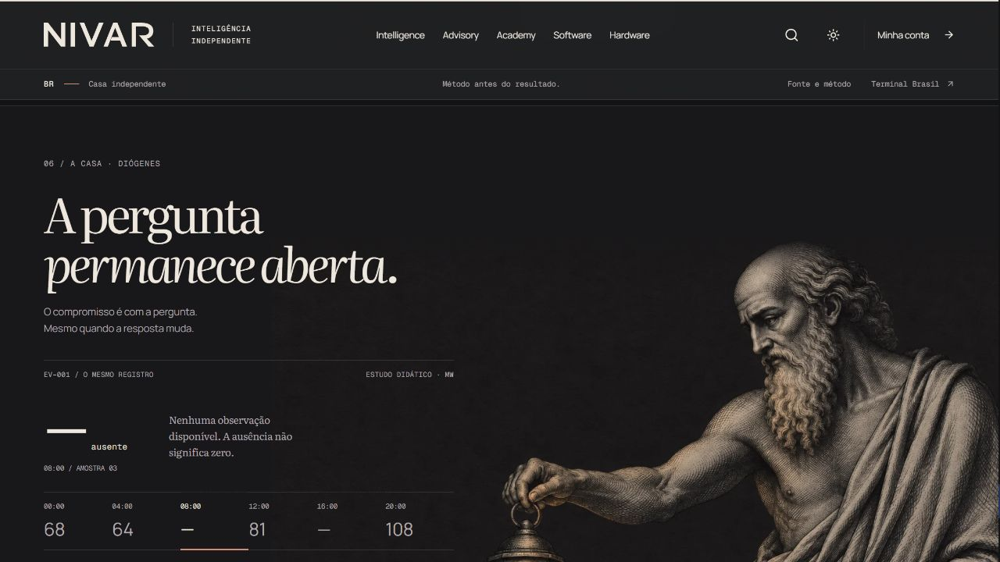
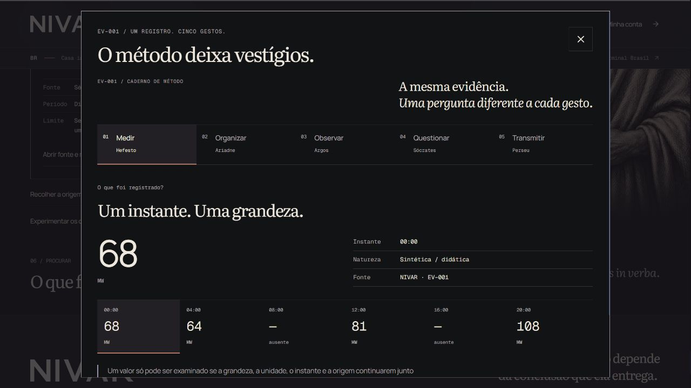
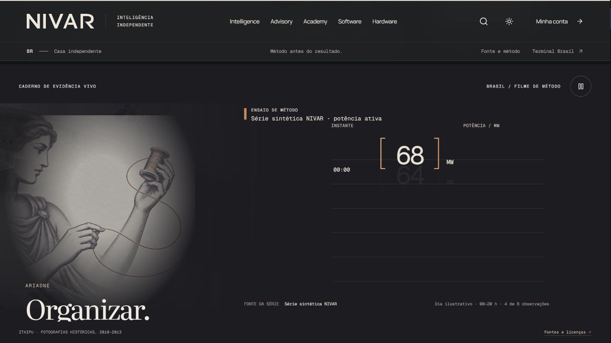
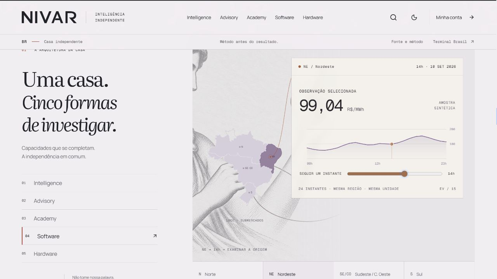
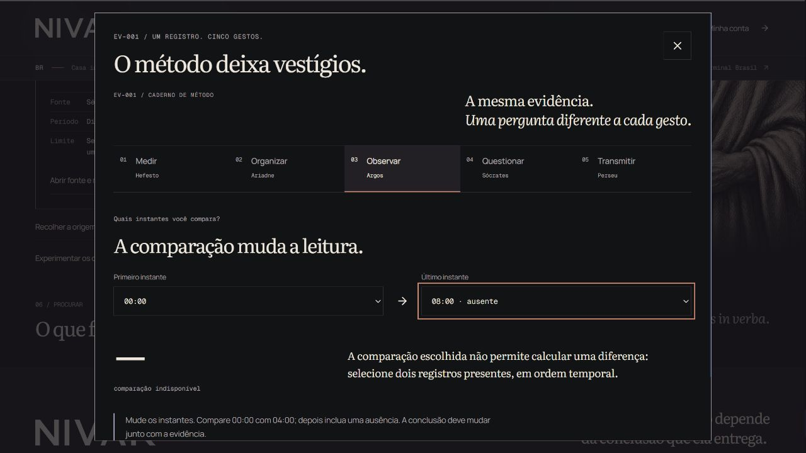
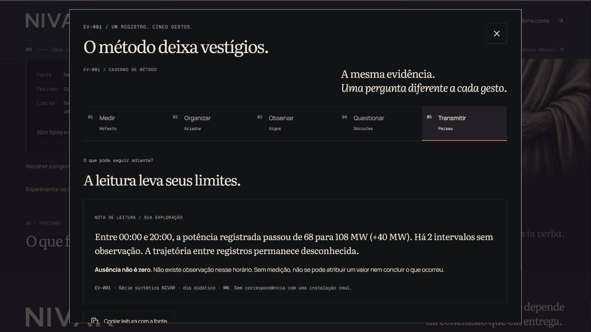
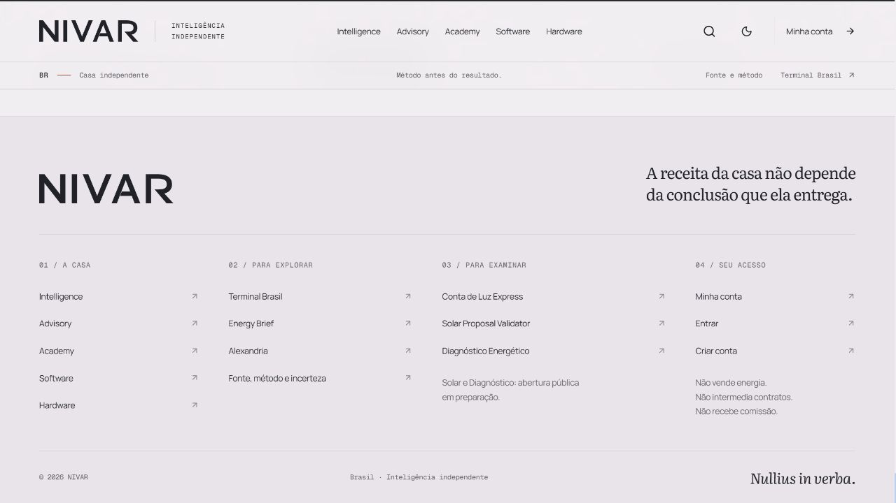

# Fresh motion and composition review — 01

Reviewed 2026-09-12 through the running `/br` experience. No implementation, tests, prior reasoning, or feature checklist was read. This is an independent browser observation, with a later replay of the timestamp correction reported by the builder.

## Verdict

The opening now has a recognizable evidence object and an intelligible method. Itaipu establishes a real Brazilian world; the bracketed 68 MW observation survives its move into a table and chart; missing observations remain explicit; the paper turn makes transmission feel authored. The notebook goes further: changing an endpoint or testing a claim changes the conclusion and the final note.

The largest remaining concrete interaction gap I reproduced is **loss of the selected observation when Diógenes opens the five-gesture notebook**. The larger art-direction opportunity is to make the opening's final paper become a usable instrument with the same continuity that the 68 token already has. At present the instrument handoff is explained by the separate block beneath the film and introduces a clearly labeled second sample.

## Highest-impact remaining finding

**P2 — Carry the selected observation into the notebook.**

- Viewport: 1280 × 720, dark theme.
- Exact steps: open `/br#a-pergunta-continua`; select `08:00: dado ausente`; optionally open `Iluminar origem e limites`; click `Experimentar os cinco gestos`.
- Observed result: Diógenes shows `08:00 / AMOSTRA 03`, an absent value, and the explanation that absence is not zero. The notebook opens `01 Medir` at `00:00`, `68 MW`, with that different observation selected.
- Effect: the visitor has just chosen a question, but entering the next instrument silently restarts the example. This is the clearest remaining break in the otherwise strong promise that evidence and its context travel together.
- Concrete fix: initialize the notebook's selected record from the finale selection. Keep the absent state selected when opening from 08:00 or 16:00. Carry that selection into the highlighted Organizar row; offer an explicit restart if the teaching sequence requires 00:00.
- Evidence: `fresh-motion-evidence/finale-desktop-gap.png` → `fresh-motion-evidence/five-gestures-01-reset.png`.

## Timestamp finding and verification

**Original P2, now resolved at desktop:** during actual playback at approximately 5.5 seconds, `00:00` crossed the lower-left orange bracket while 68 shrank into the record row. This was visible in `desktop-framed-5-5.png`; it was a real overlap in the captured UI, not a padded-image artifact.

The builder changed the path, and I reloaded and captured untouched playback across UI times 4.0–6.5 seconds. The timestamp now moves below the bracket, reaches the left column, and rises with clear space. The 5.3, 5.5, 5.6, and 5.9 second frames substantiate the correction. **Do not retain this as an open desktop issue.**

The verification sequence contains 18 native frames; `fresh-motion-evidence/fixed-path-metadata.json` records the corresponding times read from the rendered film slider. This is sampled live playback, not a continuous high-frame-rate video.

## Observed steps and health

1. **Opening world and measurement — strong.** Real Itaipu photography gives Brazil an identifiable presence. The 68 MW value is legible as a specific recorded object, with a unit and timestamp. Its synthetic nature is stated independently of the historical photography.
2. **Record into chart — strong after the timestamp correction.** The same value and bracket identity survive the table-to-chart transformation. The two dashes remain visible as missing observations. Values pass through non-data positions during the transition, then settle; interpretation belongs to the settled chart.
3. **Question and transmission — strong internal continuity; weaker final handoff.** The missing intervals are highlighted, and the chart turns into a paper-like reading. The 17-second edge-on turn is a distinct authored transition. The separate Terminal block uses a new price sample and explicitly says so, preserving truthfulness. However, the movie returns to the world around 23.5 seconds rather than leaving the visitor with a manipulable EV-001 object.
4. **Family architecture — clear and distinctive on desktop.** The sticky five-family index, large family names, illustrations, and distinct roles make the house understandable. In light theme, Intelligence's landscape and Ariadne's figure/map retain a coherent editorial character.
5. **Ariadne territory → observation → origin — particularly strong causal UI.** Selecting Nordeste produces a 14h observation of 99.04 R$/MWh, with the region still visible. Following the source reveals the origin beside the retained observation. The composition visibly reorganizes around the action; it is more than a generic card replacement. Intermediate screenshots briefly caught the scroll/transition before it settled; those transient crops are not reported as defects.
6. **Diógenes — strong evidence interaction, with the selection reset above.** Selecting 08:00 produces an absent state and explains that it is not zero. The source reveal specifies EV-001, the didactic period, the missing times, and the absence of interpolation or claims about a real installation.
7. **Five gestures — functional and meaningfully causal.** All five tabs were opened. In Observar, 00:00 → 04:00 changes the result to −4 MW; 00:00 → 08:00 changes it to an unavailable comparison. In Questionar, selecting `Não houve produção às 08:00` yields `Ausência não é zero`. Transmitir includes the selected claim's examination in its note. The notebook is tall at 720px, so lower explanations and actions require its internal scroll; I did not find overlapping content in the inspected panels.
8. **Footer — healthy on desktop, dark and light.** Four clear index columns, a visible independence statement, the public-preparation note, and a restrained closing signature complete the house without a generic newsletter block.

## Concrete motion direction to consider next

At the end of the film, retain the EV-001 paper for a short readable hold and give it a direct `Examinar este registro` action into the existing five-gesture notebook, initialized to the same record. Keep the price Terminal block as the next, explicitly different demonstration. This adds no false equivalence between MW and R$/MWh and turns the final authored object into agency. It would strengthen world → record → question → instrument without adding another decorative transition.

## Reference comparison and evidence limits

I read the primary creator case study, [The Spark: Engineering an Immersive, Story-First Web Experience](https://tympanus.net/codrops/2026/01/09/the-spark-engineering-an-immersive-story-first-web-experience/). Its relevant stated principle is that the UI changes with the story's events and shares the scene's timing. That principle supports the continuity recommendation above. The article also acknowledges mobile composition limits, so it is not evidence that desktop cropping is acceptable for NIVAR.

I opened the live [The Spark](https://spark.thedigitalpanda.com/) example and observed its entry screen's noise and changing system text. Click and a supported drag gesture did not complete its press-and-hold gate in this browser session. **I did not see its full camera/character narrative and do not claim a direct full-motion comparison.** `reference-spark-start.png` records the accessible entry state.

Additional limits:

- Native screenshots worked at the default 1280 × 720 desktop viewport. Two 24-second passes were sampled at half-second bins; files named `desktop-live-*` and `desktop-framed-*` cover their actual playback states. Play-control activation changed the viewport position, so these passes show a partial-height film. The word `framed` in a filename does not imply full-canvas coverage. The later untouched `fixed-path-*` pass has the full relevant measurement-to-record area.
- The 390 × 844 and larger desktop overrides produced a padded first capture, then `Unable to capture screenshot`, including after separate set/reload/native-capture calls. Reset recovered default captures. **No responsive verdict is claimed from that failure, and no padding is blamed on the product.** The requested 390/430 visual review remains unverified in this isolated browser session.
- Reduced-motion preferences were not exposed by the supported browser capability used here. Pause, restart, timeline, chapter controls, and notebook controls were inspected, but OS reduced-motion behavior was not verified.
- No screen-reader audit, measured contrast audit, real-data validation, account workflow, or submission was performed. Screenshots alone do not establish accessibility compliance.
- `footer-desktop-light.png` caught the theme transition before the masthead settled; use `footer-desktop-light-settled.png` as accepted light-footer evidence.

## Follow-up: final supplied native recordings

After this review, the builder supplied untouched final Hero captures at CSS 390 × 844 and 1440 × 1000, plus a live Terminal interaction capture. Those supplied frames were independently inspected and assembled using their actual capture intervals. The [recording README](../evidence/motion/README.md) documents exact crops, provenance, timing, hashes, and limits. Use [final mobile Hero](../evidence/motion/hero-mobile-final.mp4), [final desktop Hero](../evidence/motion/hero-desktop-final.mp4), and [live Terminal](../evidence/motion/terminal-1440-native.mp4) for final review; the earlier desktop takes above are historical.

This follow-up supplies limited mobile composition evidence that was unavailable in my isolated browser: mobile final frames at 5.3/5.5/5.8 seconds clear the timestamp crossing; frames at 12.1–13.9 seconds clear the source/question overlap that was found in an earlier supplied mobile take. Frames at 18.0–19.4 seconds keep the transmitted reading and its chart separated. The captured UI is smaller than its CSS viewport inside tool padding, so this does not establish full-resolution typography, touch behavior, 430-width layout, or reduced-motion behavior. The notebook selection fix was being verified separately by the builder and is not re-judged by these Hero/Terminal recordings.
