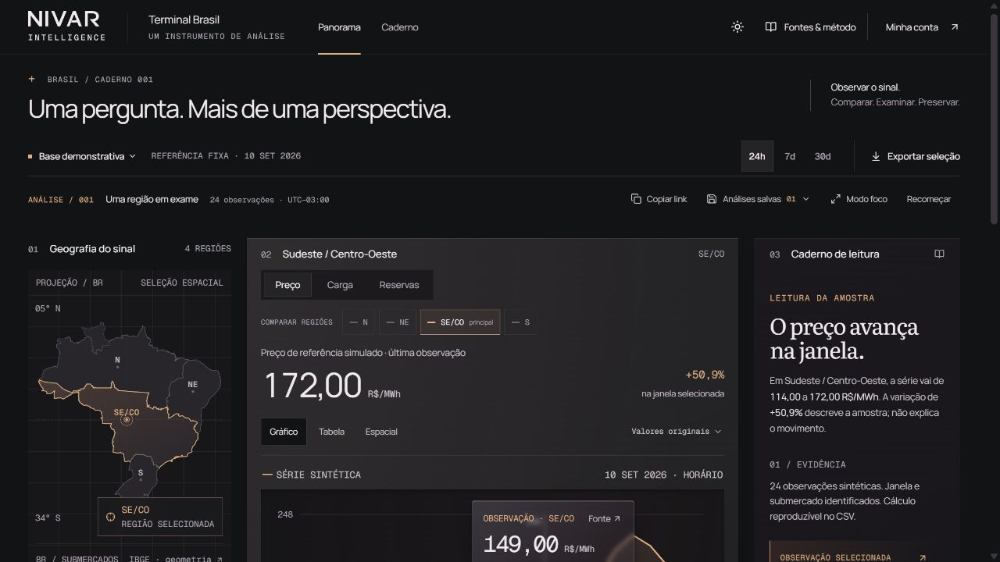
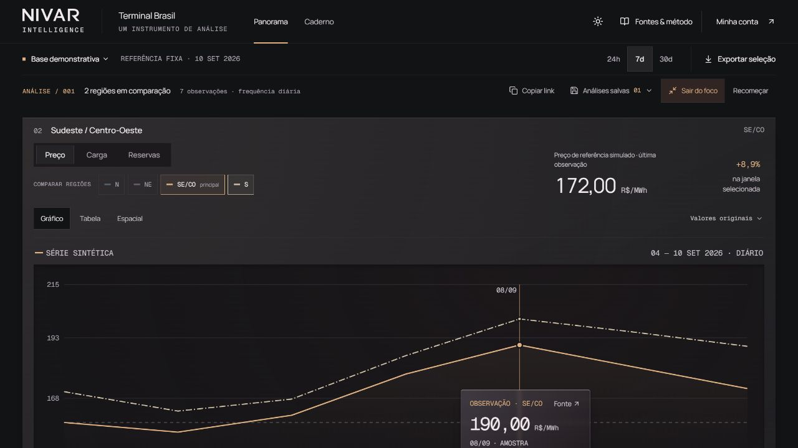
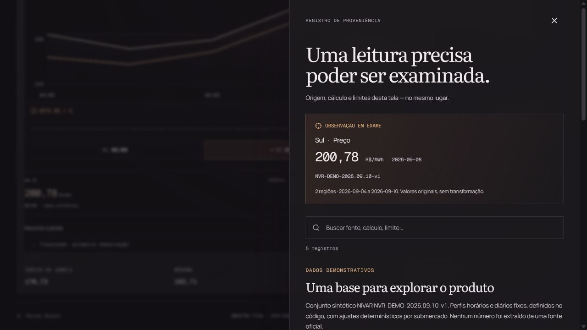
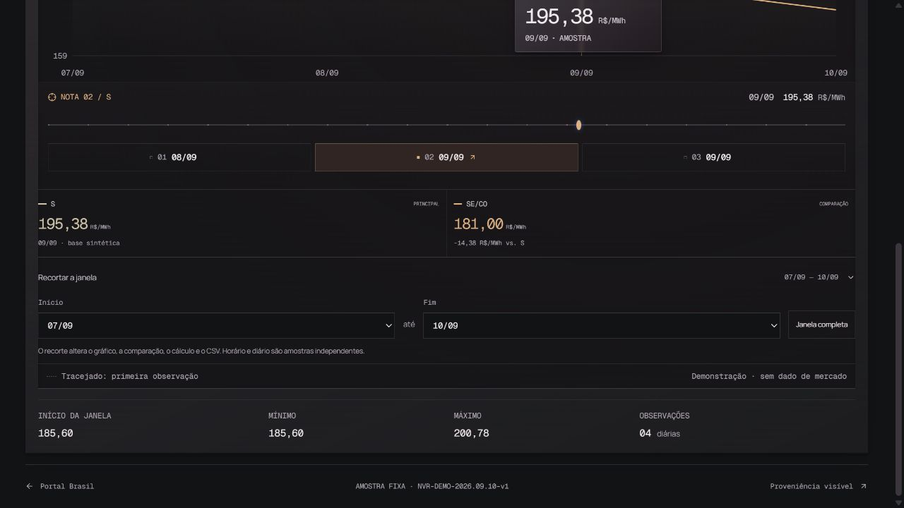
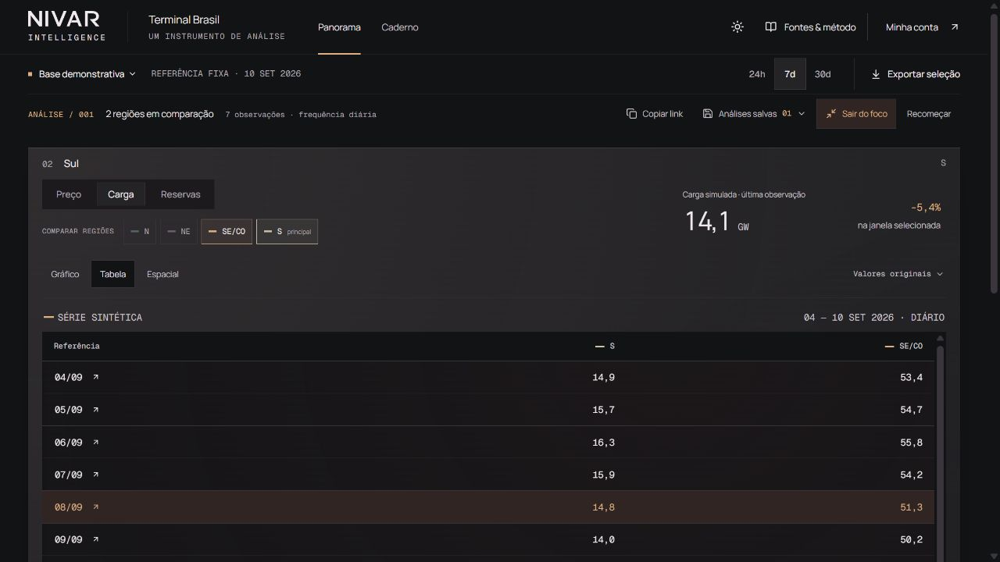

# Independent terminal workflow critique — 12 September 2026

This is a fresh hands-on critique of the running NIVAR terminal at `http://127.0.0.1:5173/br/terminal`, using CUA browser interaction. I did not read implementation, tests, builder reports, or design rationale. All data was treated as synthetic. The desktop screenshots below were captured in this run, saved, and inspected. No runtime files were edited.

The terminal already supports a meaningful analytical loop: compare regional series, inspect a shared timestamp, examine provenance without losing context, change the window, inspect tabular values, and preserve a named selection. Its main trust failure in this run was that changing the analysis window silently changed the observation being examined. A professional instrument must keep the identity of the evidence stable while the analyst changes its frame.

## Question and useful result

**Question:** Does the Sul price premium over Sudeste/Centro-Oeste widen around 8 September, and does load move with it?

The seven-day price table showed Sul/SE-CO values of 200.78/190.00 R$/MWh on 8 September, 195.38/181.00 on 9 September, and 189.47/172.00 on 10 September. The premium therefore widened from 10.78 to 14.38 to 17.47 R$/MWh while both prices fell. Switching to Carga retained the regions and date; on 8 September the displayed values were 14.8 and 51.3 GW. This makes descriptive comparison possible. The terminal correctly says the data cannot establish transmission constraints or causation.

## Workflow and health

1. **Form the question — good.** Opened the default 24-hour SE/CO price view. Synthetic status, units, fixed reference date, the primary geography, and metric choice were visible. The source badge is subdued, but the product consistently repeats its demonstration status.

   

2. **Compare regions and time — good.** Added Sul, changed to 7d, and entered Modo foco. Two curves shared one frequency and time window. The selected-point cards exposed the actual inter-regional difference. Clicking Sul's card made Sul the primary region and retained SE/CO as comparison. Focus mode gives the chart useful width, although its inspection controls still require vertical scrolling at 1280 × 720.

   

3. **Inspect source, units, and date — good.** Opened the selected point's Fonte control. The drawer preserved Sul, Preço, 200.78 R$/MWh, 2026-09-08, both regions, the selected date span, scale, and dataset version. Its text explicitly explains that hourly and daily samples are independent and cannot be treated as interchangeable aggregations. It distinguishes the fixed synthetic dataset from an official ingestion. This is useful provenance, not merely a source logo.

   

4. **Crop around the observation — broken continuity.** With Nota 02 at 08/09 selected, opened Recortar a janela and changed Início from 04/09 to 07/09, keeping Fim at 10/09. The selected observation jumped to 09/09 and the Sul value became 195.38 R$/MWh. Both Nota 02 and Nota 03 then pointed to 09/09. The original 08/09 observation was still inside the crop. Janela completa restored 08/09 and 200.78, confirming the issue depended on the framing operation.

   

5. **Change the analytical lens — useful but bounded.** Switched to Carga and Tabela. Both regions remained selected, the date remained 08/09, and the table made the common dates and GW unit explicit. Price and load occupy the same panel sequentially; there is no observed way to keep the original price evidence visible while examining the load response. That limits hypothesis testing, but the immediate priority is stable evidence identity.

   

6. **Preserve and return — working, with an export verification limit.** Returned to price/table, saved “Crítica independente · Sul x SE/CO · 08 set”, switched to load, and restored the named save. The app restored price, seven-day window, regions, table, and 08/09 selection, and confirmed restoration. Exportar seleção reported “CSV demonstrativo de 2 regiões, 7 observações por região, Preço exportado.” I verified the UI confirmation, not the downloaded CSV bytes. Copiar link returned the full selection URL. The existing unrelated saved analysis was left untouched.

7. **Mobile — controls observed; visual check blocked.** Set the documented browser viewport to 390 × 844. The accessibility tree reflowed to mobile-specific region and time controls, an expandable geography control, and Exportar amostra. Two screenshot attempts failed, so there is no accepted mobile screenshot and no mobile visual or touch-usability verdict. Requested viewport reset before ending the check. Full-page capture also failed; desktop viewport screenshots are the accepted visual evidence.

## Largest gap observed

**Severity: High analytical impact; fix before presenting this as a dependable research instrument.** A crop can replace the selected evidence without an explicit choice or notice. The changed value is plausible, and the same Nota 02 label remains active, making the substitution easy to overlook. A user narrowing the surroundings of an event can unknowingly start explaining a different date or preserve a different observation.

**Exact reproduction:** select 7d → compare Sul and SE/CO → use Sul as primary → select Nota 02, 08/09 (200.78 R$/MWh) → open Recortar a janela → set Início to 07/09, leaving Fim at 10/09 → observe Nota 02 and the point inspector switch to 09/09 (195.38 R$/MWh), despite 08/09 remaining in view.

**One concrete fix:** Anchor the selected observation and each note to a stable dataset timestamp/observation identity, independently of the visible window. Cropping should retain an included observation; if it excludes that observation, show its excluded state or explicitly announce the replacement. Notes outside the window should retain their identity and be visibly out of range rather than move onto other dates.

## Professional-tool comparison

The ONS's own description of its [Histórico da Geração Eólica e Fotovoltaica](https://www.ons.org.br/Paginas/resultados-da-operacao/historico-da-operacao/historico-geracao-eolica-fotovoltaica.aspx) describes user-chosen variables, period, temporal discretization, and levels of aggregation down to connection point or plant, plus printing and spreadsheet export. The ONS also documents supervision/measurement sources and how historical gaps are replaced with verified data. This is a primary-source capability comparison, not a hands-on audit of the ONS dashboard.

Against that reference, NIVAR is convincing at one metric across submarkets: common time, point inspection, tabular reading, and a preserved configuration are real analytical behaviors. It is narrower at following a hypothesis through related variables and finer geography. More dimensions would deepen it, but they would not compensate for an observation that changes identity when the user simply narrows the date frame.

## Accessibility and evidence limits

The observed desktop offers text labels, explicit units, region names, a slider, table rows, and a source drawer whose close control receives focus. The table provides a valuable alternative to reading curves. Small and subdued secondary labels and note controls warrant contrast and target-size checks, but no contrast measurement, screen-reader session, or keyboard-only completion was performed. The native accessibility snapshot omitted the text of the open save form, while the DOM snapshot exposed its name and buttons correctly; this is not sufficient evidence to declare a production screen-reader defect.

No authenticated areas, real API writes, operational sources, or market decisions were tested. No numerical score is assigned. This report records the initially observed behavior; any subsequent fix needs a separate retest statement.

## Preserved state

Named local save: **Crítica independente · Sul x SE/CO · 08 set**.

[Return to the price comparison](http://127.0.0.1:5173/br/terminal?region=sul&period=7d&metric=price&source=sample&tone=graphite&note=1&view=table&scale=native&start=0&end=6&dataset=NVR-DEMO-2026.09.10-v1&compare=sudesteCentroOeste).

## Post-change retest attempt — blocked by browser availability

A focused retest was requested after the implementation was changed. I did not independently verify that change. Reloading the previous CUA tab returned “Browser is not available: 1”; the CUA inventory then returned no browsers; creating a new hidden in-app tab returned “Browser is not available: iab”. No post-change UI was accessed and no post-change screenshots were captured. The original finding above remains historical evidence, not a claim that the same behavior persists after the change.

The next independent UI check should confirm these three transitions: (1) Sul + SE/CO, 7d, Nota 02 at 08/09 and 200.78 R$/MWh, crop start to 07/09 and retain the selected timestamp/value; (2) crop start to 09/09 and explicitly identify the excluded observation and any replacement, while note dates stay fixed; (3) restore the 08/09 observation and switch 7d → 30d → 7d without changing that daily observation. A code or test report would not substitute for that UI check.
