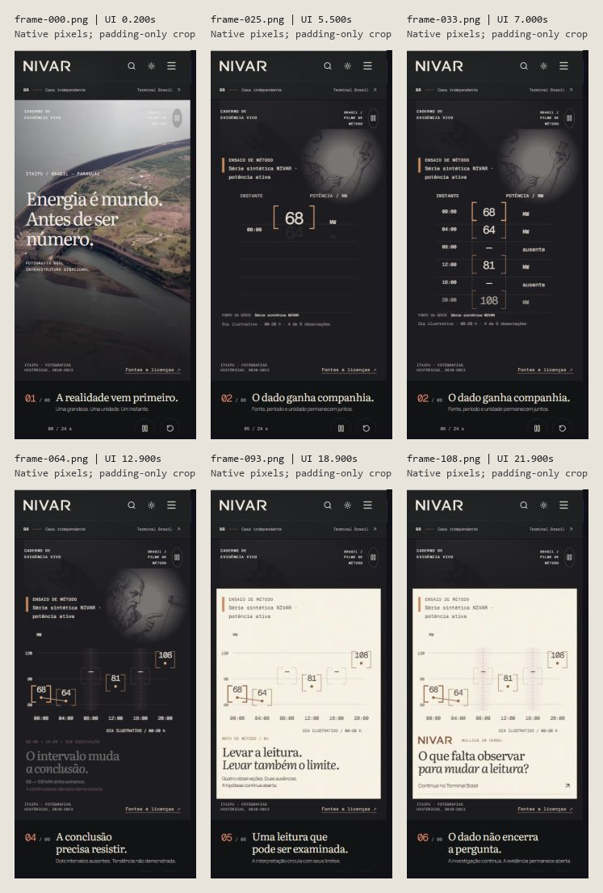
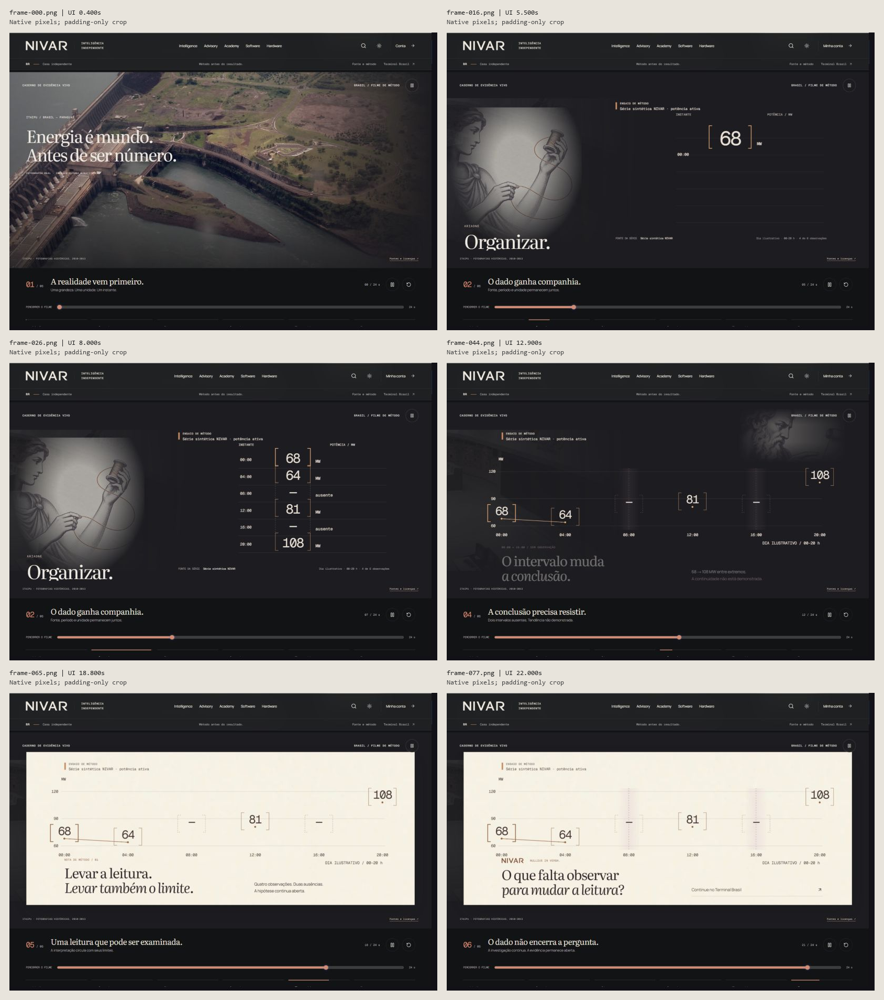
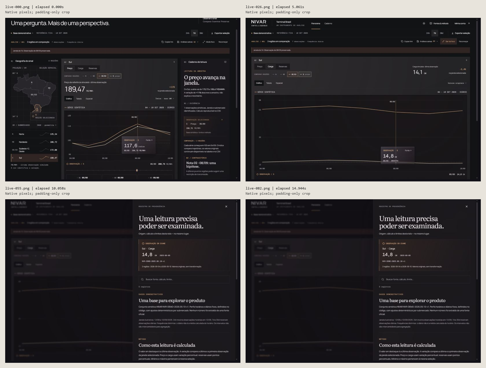

# Final native playback recordings

These are **timestamped recordings assembled from screenshots of actual running UI**. They preserve the observed order and actual capture intervals. They are not continuous 30/60 fps screen recordings, reconstructed animation, or chapter slides presented as live motion.

## Review these three MP4s

| Recording | Captured CSS viewport | Frames | Encoded duration | Encoded pixels | Average captured frames/s |
| --- | --- | ---: | ---: | --- | ---: |
| [Final Hero — mobile](hero-mobile-final.mp4) | 390 × 844 | 120 | 24.174 s | 226 × 482 | 4.964 |
| [Final Hero — desktop](hero-desktop-final.mp4) | 1440 × 1000 | 83 | 23.472 s | 818 × 568 | 3.536 |
| [Terminal — live interaction](terminal-1440-native.mp4) | 1440 × 1000, as supplied by the recorder | 87 | 15.627 s | 816 × 568 | 5.567 |

The Hero recordings are the **final takes**, after the timestamp path and source/question transition corrections. Older `hero-mobile-390-native*` and `hero-desktop-1280-sampled*` recordings remain local historical evidence and are not recommended final review artifacts.

## Native capture crop and provenance

The capture tool painted a smaller view of the UI inside a padded image. The crop removes only the uniform outer padding, RGB **(18, 17, 23)**. Every frame in each final take was checked against the stated exclusive bounds; all frames had the same non-padding bounding box. A faint capture edge was preserved rather than cut away.

| Take | Original PNG pixels | Exact retained rectangle `(left, top, right, bottom)` | Retained native pixels | Compatibility padding |
| --- | --- | --- | --- | --- |
| Mobile final | 390 × 844 | `(0, 0, 225, 481)` | 225 × 481; visible UI body approximately 219 × 474 | One column right and one row bottom |
| Desktop final | 1440 × 1000 | `(0, 0, 817, 568)` | 817 × 568 | One column right |
| Terminal | 1440 × 1000 | `(0, 0, 816, 568)` | 816 × 568 | None |

No image was resized, sharpened, redrawn, or interpolated. The small compatibility pads allow ordinary H.264 4:2:0 playback; they do not change the native UI pixels' spatial positions. These captures do **not** establish full-resolution 390/1440 pixel typography or device-rendering fidelity. Black padding is a capture artifact, not a product layout defect.

Original sources, retained locally:

- `mobile-final/frame-*.png` and `mobile-final/metadata.json`.
- `desktop-final/frame-*.png` and `desktop-final/metadata.json`.
- `terminal/live-*.png` and `terminal/live-metadata.json`. Other step screenshots in `terminal/` are separate regression evidence and were not inserted into the live recording.

`final-recordings-manifest.json` gives the three MP4 hashes, source metadata, crop bounds, frame counts, durations, and hashes of the local lossless verification masters. Each `*-provenance.json` also retains every raw/prepared frame hash, encoder arguments, packet timestamps, and ffprobe output. Raw PNGs, prepared crops, and RGB masters are retained locally; they need not be committed with the small portable review package.

## Timing and encoding

For each source frame, ffmpeg concat holds that frame until the next frame's **recorded `elapsedMs`**, normalized so the first captured frame begins at video time zero. No missing interval is filled with invented frames. Every final encoded packet's presentation timestamp was checked against its original elapsed timestamp to millisecond precision.

The last frame has only a 1 ms packet duration. There is no invented tail hold. Consequently these encoded durations are shorter than the recorder's approximately 25-second/16-second tool sessions:

- Mobile begins at captured UI time 0.2 s, covers the film through 23.8 s, and includes the loop return through 0.3 s.
- Desktop begins at UI time 0.4 s and ends at 23.8 s. The missing beginning and final loop-reset moment are not fabricated.
- Terminal spans the first capture at elapsed 509 ms to the last at 16,135 ms.

Delivery files use `libx264`, CRF 15, `yuv420p`, variable frame timing, no B-frames, and fast-start MP4. The 1/1000 timebase supports exact millisecond timestamps; ffprobe may report `r_frame_rate=1000/1` as a timing grid. **There are only 120, 83, and 87 actual video frames**, respectively, not 1000 fps footage.

Local `*-rgb-lossless.mp4` verification masters use lossless `libx264rgb` at the exact retained dimensions. Every decoded RGB frame was compared pixel for pixel to its cropped source PNG, in source order, and passed. The ordinary MP4s use chroma conversion and compression for playback compatibility; use the PNGs or RGB masters when pixel-exact color inspection is required.

`assemble_recordings.py` contains the reproducible assembly and verification. `package_recording_proof.py` builds the native-pixel contact sheets, verifies delivery MP4 timing, and writes the final manifest. `portable-files.txt` enumerates the suggested review package without raw frames or RGB masters.

## Visual QA

The contact sheets paste the cropped source pixels without resizing; labels are placed in separate gutters. Exact selected source files and UI/elapsed timestamps are recorded in `contact-sheet-selections.json`.

Targeted final findings:

- **Timestamp path passes.** Mobile `frame-024.png` at 5.3 s, `frame-025.png` at 5.5 s, and `frame-026.png` at 5.8 s keep `00:00` separated from 68 and its brackets. Desktop `frame-016.png` at 5.5 s also shows clear separation.
- **Source/question overlap is resolved in sampled final frames.** Mobile `frame-060.png`–`frame-069.png` at 12.1–13.9 s show the source/day metadata leaving before the question becomes visible. The old take's 12.6–13.1 s collision is not present. This judgment was made from the image pixels, not only the supplied opacity metadata.
- **Transmission remains separated.** Mobile `frame-088.png`–`frame-096.png` at 18.0–19.4 s keep the cream notebook chart, reading, and supporting copy apart. All six chapter compositions were inspected across the native contact sheets.
- **Terminal is actual interaction footage.** The sequence shows the captured analytical view, a focused chart with a changed metric, and the opened source panel. It preserves all intervening captured frames; the contact sheet is only an index into that recording.
- The encoded delivery files were decoded for representative frame inspection. Crop, aspect, content, and frame ordering matched the accepted source views.

Limits: sampling can miss a short event between frames and cannot establish high-frame-rate smoothness. Captured mobile controls sometimes extend below the recorded viewport while the top pause control remains visible. No 430-width, reduced-motion, touch-device, screen-reader, audio, or real-data correctness claim is made by these files. No audio was recorded or added.
